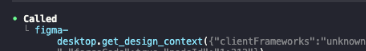
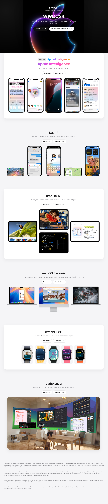

หลายคนที่เคยลองให้ AI ช่วยเขียนหน้าเว็บน่าจะเจอปัญหาเดียวกัน คือโค้ดที่ได้มัน “คล้าย” แต่ไม่เคย “เหมือน” ดีไซน์ใน Figma

ยิ่งโปรเจ็กต์ไหนต้องการความ pixel-perfect, spacing เป๊ะ, หรือยึดตาม design system ที่ซับซ้อน หน่อย AI ก็จะเริ่มเพี้ยน เช่น สีผิดนิดๆ, space ไม่ตรง, หรือ component ใช้ไม่ถูกตัว

ปกติเราก็แก้กันด้วยการ
- พยายามอธิบายดีไซน์ใน prompt
- หรือแคปหน้าจอส่งให้ AI เดา layout เอง

จะดีกว่าไหมถ้า AI สามารถอ่าน Figma ได้โดยตรง เข้าใจ component, constraints, spacing, typography ทั้งหมดเหมือนนักออกแบบนั่งอธิบายให้ฟัง

## ข้อกำหนดเบื้องต้น (Prerequisites)
ก่อนที่เราจะให้ AI ช่วยเขียน UI จาก Figma ได้แบบแม่นๆ มีสิ่งที่ต้องเตรียมก่อนดังนี้:
- **ChatGPT Plus** หรือสูงกว่า
เพราะใน plan plus เป็นต้นไปจะสามารถใช้บริษัท Chat gpt codex ได้
- **Figma  Professional** หรือสูงกว่า
เพราะใน plan professional จะใช้ dev mode ได้ซึ่งเป็น mode ที่ช่วยให้ dev สามารถทำงานใน figma ได้ง่ายขึ้น
- **Figma Desktop** 

## รัน MCP server
โดยในการทดสอบเราลอง ให้ codex สร้าง landing page ง่ายด้วย design นี้  [Apple landing page - WDC24 (Community](https://www.figma.com/community/file/1382343443870598429)


กดปุ่ม open in figma เพื่อสร้าง copy โปรเจกต์ใส่ workspace ของเรา

เปิดไฟล์แล้วคิลกที่ icon `</>` เพื่อเปิด dev mode


เลือก frame หรือ object ที่ต้องการทำ reference จากนั้น คลิกขวา เลือก `Copy link to selection`


เปิด codex และพิมพ์ คำสั่ง `/mcp` เพื่อเช็คว่า เราเซ็ต mcp สำเร็จไหม


> ถ้าขึ้น figma-desktop status เป็น enabled แปลว่า codex ของเราสามารถเชื่อมต่อกับ figma ได้แล้ว

จากนั้นลองให้ codex สร้าง landing page โดยการพิมพ์ prompt ดังต่อไปนี้
```
replace index page with landing page by get design from @ใส่ลิงค์ ที่ได้จากการ copy link to selection
```



> จากรูปจะสังเกตุได้ว่า codex มีการไปเรียก mcp tool ที่ figma-desktop

และนี้คือผลลัพท์ที่ได้จาก codex~



> เหมือนไหมนะ 5555... ก็เหมือนอยู่นะ อย่างน้อย codex ก็สามารถไปดึงภาพ asset มาใส่ project ได้

## Tip
จากที่ทดลองถ้าอยากได้ design หรือการจัดวาง element ที่ใกล้เคียงกับ figma ที่สุดแนะนำให้ scope ให้เล็กลงเช่น ให้ AI generate component เล็กๆ เช่น ปุ่ม, navigator bar