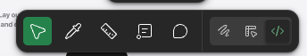
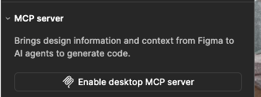
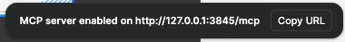
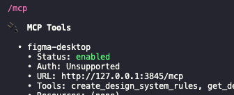
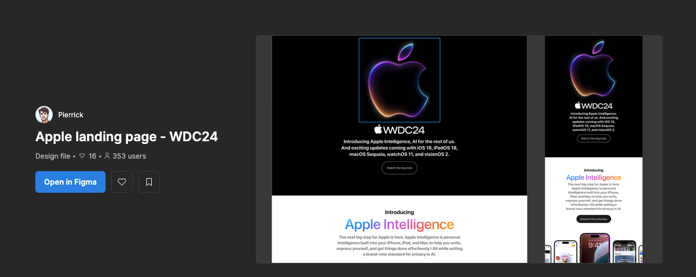
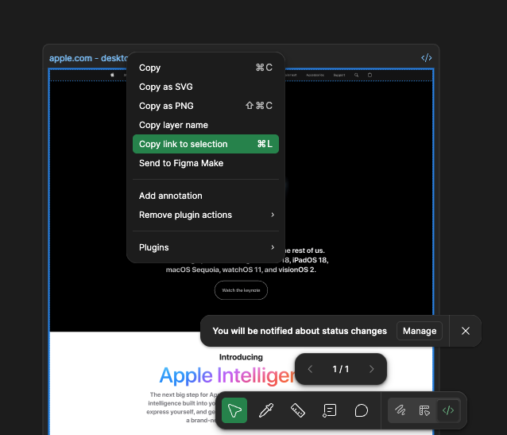
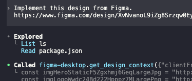
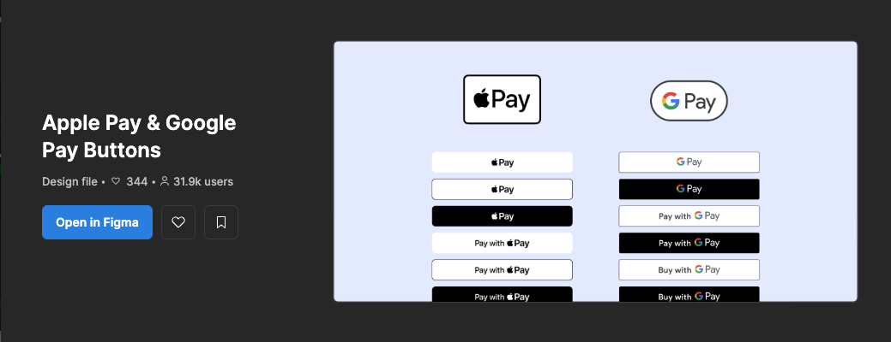
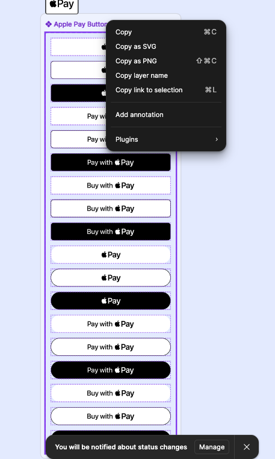
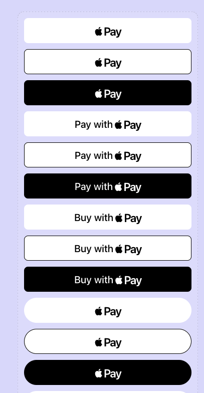

หลายคนที่เคยลองให้ AI ช่วยเขียนหน้าเว็บไซต์น่าจะเจอปัญหาเดียวกัน คือโค้ดที่ได้มัน “คล้าย” แต่ไม่เคย “เหมือน” ดีไซน์ใน Figma

ยิ่งโปรเจ็กต์ไหนต้องการความ pixel-perfect, spacing เป๊ะ, หรือยึดตาม design system ที่ซับซ้อน หน่อย AI ก็จะเริ่มเพี้ยน เช่น สีผิดนิดๆ, space ไม่ตรง, หรือ component ใช้ไม่ถูกตัว

ปกติเราก็แก้กันด้วยการ

- พยายามอธิบายดีไซน์ใน prompt
- หรือแคปหน้าจอส่งให้ AI เดา layout เอง

จะดีกว่าไหมถ้า AI สามารถอ่าน Figma ได้โดยตรง เข้าใจ component, constraints, spacing, typography ทั้งหมดเหมือนมีนักออกแบบนั่งอธิบายให้ฟัง

## ข้อกำหนดเบื้องต้น

ก่อนที่เราจะให้ AI ช่วยเขียน UI จาก Figma ได้แบบแม่นๆ มีสิ่งที่ต้องเตรียมก่อนดังนี้:

- **ChatGPT Plus** หรือสูงกว่า
  เพราะในแผน plus จะสามารถใช้ codex ได้
- **Figma Professional** หรือสูงกว่า
  เพราะในแผน professional จะสามารถใช้ dev mode ได้ ซึ่งเป็นฟีเจอร์ที่มี mcp server อยู่ในโหมดนี้ด้วย
- **Figma Desktop** เพราะในบทความนี้เราจะใช้ Figma desktop ในการรัน mcp server

## เริ่มเชื่อมต่อ Figma MCP กับ Codex

ในขั้นตอนนี้เราจะลองใช้งาน Codex ร่วมกับ Figma MCP กัน ก่อนเริ่มใช้งาน มาตั้งค่ากันให้เรียบร้อยก่อน

### เปิด Server mcp ใน figma

เปิดโปรแกรม Figma desktop จากนั้นเปิดโปรเจกต์อะไรก็ได้

สังเกตุ menu ด้านล่าง คลิกที่ icon `</>` เพื่อเปิด dev mode



สังเกตุ side bar ด้านขวามือจะมี section `MCP server` ให้คลิกปุ่ม `Enable desktop MCP server`


จะขึ้นข้อความแจ้งเตือนดังภาพ ให้คลิกปุ่ม `Copy URL` เป็นอันเสร็จขั้นตอนการ เปิด server mcp


### ตั้งค่าการเชื่อมต่อ mcp ใน codex

เปิดไฟล์ `~/.codex/config.toml` จากนั้นเพิ่มข้อมูลการตั้งค่าการเชื่อมต่อ figma mcp ไว้บรรทัดล่างสุดของไฟล์

```
[mcp_servers.figma-desktop]
url = "http://127.0.0.1:3845/mcp"
```

ทำการตรวจสอบการเชื่อมต่อด้วยการเรียกใช้งาน codex และ พิมพ์คำสั่ง `/mcp`



> ถ้าขึ้น figma-desktop status เป็น enabled แปลว่า codex ของเราสามารถเชื่อมต่อกับ figma ได้แล้ว

### ทดลองสร้าง Landing page

โดยในการทดสอบนี้เราจะลอง ให้ codex สร้าง landing page ง่ายๆ ตาม design นี้ [Apple landing page - WDC24 (Community](https://www.figma.com/community/file/1382343443870598429)



เลือก frame ที่ต้องการ reference จากนั้นคลิกขวา เลือก `Copy link to selection`



สั่งให้ codex สร้าง landing page ด้วย prompt ดังต่อไปนี้

```
Implement this design from Figma.
// link to selection figma
```



> จากรูปจะสังเกตุได้ว่า codex มีการไปเรียกใช้งาน mcp tool ที่ figma-desktop

และนี่คือผลลัพธ์ที่ได้จาก Codex~


> เหมือนไหมนะ... ก็เหมือนอยู่นะ 5555
>
> จากที่เห็นทั้งโครงสร้าง layout และการวาง element ต่าง ๆ ถือว่าใกล้เคียงกับใน Figma พอสมควร แถม Codex ยังดึงภาพ asset จาก Figma มาใช้ได้ตรง ๆ อีกด้วย

แต่ถ้าสังเกตดีๆ จะเห็นว่า asset ที่ Codex ดึงมานั้น **ถูกอ้างอิงตาม path ของ MCP server บนเครื่องเรา**
เช่น http://localhost:3845/ ซึ่งเป็น URL ชั่วคราวที่ใช้เฉพาะตอน Dev เท่านั้น

เพราะฉะนั้นเวลารันโปรเจกต์ใน local หรือเอาไป deploy จริง
**เราต้อง copy ไฟล์ asset จาก Figma MCP มาเก็บไว้ในโฟลเดอร์ asset ของโปรเจกต์เอง**
ไม่งั้น path ที่ถูก generate จะลิงก์ไม่เจอ และรูปทั้งหมดจะโหลดไม่ขึ้นทันที

### ทดลองสร้าง Component

คราวนี้มาลองทดสอบอีกแบบ โดยให้ codex สร้าง component ดูบ้างว่าจะทำได้ดีแค่ไหน

ในการทดสอบนี้เราจะให้ codex สร้าง component ปุ่มง่ายๆ ตาม design นี้ [Apple Pay & Google Pay Buttons](https://www.figma.com/community/file/964497644954552140)



เลือก component set ที่ต้องการ reference จากนั้นคลิกขวา เลือก `Copy link to selection`



สั่งให้ codex สร้าง component ปุ่ม ด้วย prompt ดังต่อไปนี้

```
Implement this design from Figma.
// link to selection figma
```

และนี่คือผลลัพธ์ที่ได้จาก Codex~



> จากที่ลองทดสอบ พอเรา scope งานให้เล็กลง ผลลัพธ์ดีขึ้นอย่างเห็นได้ชัด ทั้งดีไซน์และสเปกของ component ออกมาเกือบเหมือนใน Figma เลย

ถ้าอยากดูตัวอย่างโค้ดที่ Codex สร้างให้แบบเต็ม ๆ ลองเข้าไปดูได้ที่ repo นี้ได้เลย: https://github.com/larb26656/figma-mcp-poc

## สรุป

หลังจากการทดสอบ พบว่า:

- ถ้าเป็นงาน layout ใหญ่ๆ — **Codex แม่นกว่าเดาเองเยอะ**
- ถ้าเป็น component เล็กๆ — **แทบจะ pixel-perfect**
- การที่ MCP ดึง asset จาก Figma ทำให้ **ไม่ต้อง export อะไรเองเลย** แต่สุดท้ายเรายังต้อง copy asset ลงมาเก็บในโปรเจกต์ อยู่ดี​ ซึ่งอาจจะแก้ไขได้ด้วยการปรับ prompt ให้ละเอียดมากขึ้นด้วยการบอกให้ AI ดาวน์โหลดรูป asset ก่อนนำมาใช้งาน
- ความผิดเพี้ยนลดลงเพราะ AI มองเห็นข้อมูลจริงจาก Figma เช่น spacing, constraints, token
- โค้ดที่ generate ยังมีบางส่วนที่เลือกใช้ HTML tag ไม่เหมาะสมกับหน้าที่ของ component เช่น ปุ่มถูกสร้างด้วย `<div>` แทนที่จะเป็น `<button>` ซึ่งผู้พัฒนาต้องแก้ไขเพิ่มเติมเอง

โดยรวมถือว่าช่วยลดเวลาในการขึ้นโครง layout หรือ component ไปได้เยอะมาก เหลือเพียงงานปรับแต่งให้ใช้งานได้จริงเท่านั้น

หวังว่าบทความนี้จะช่วยให้การเขียน UI จาก Figma ด้วย AI ของคุณลื่นไหลขึ้นนะครับ
ไว้เจอกันใหม่ในบทความหน้า สวัสดีครับ

**Ref:**

- https://help.figma.com/hc/en-us/articles/32132100833559-Guide-to-the-Figma-MCP-server
- https://developers.openai.com/codex/mcp#connect-codex-to-a-mcp-server
