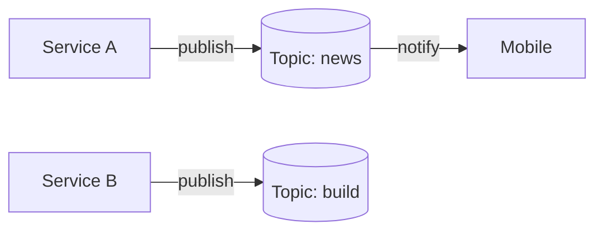

หลายคนที่เคยใช้งาน AI Agent ผ่าน IDE หรือ CLI น่าจะเคยเจอปัญหาเดียวกันอยู่บ่อย ๆ

เวลาที่เราสั่งให้มันทำงานสักอย่างหนึ่ง ไม่ว่าจะเป็นการ generate โค้ด, refactor โปรเจกต์, หรือรัน task ใหญ่ๆ ก็มักจะต้องรอสักพักกว่างานจะเสร็จ

ระหว่างนั้น เราก็เผลอสลับหน้าจอไปทำอย่างอื่น พอสลับกลับมาเช็กอีกที บางครั้งงานก็ยังไม่เสร็จ แต่บางครั้ง… มันอาจจะเสร็จไปนานแล้ว โดยที่เราไม่รู้ตัวเลย


> สภาพตอนสั่ง AI รัน task แล้วนั่งรอ

และนี่ก็เป็นปัญหาที่ผมเจออยู่บ่อย ๆ ตอนใช้งาน opencode ผ่าน CLI  จนเริ่มคิดว่า…

จะดีกว่าไหม ถ้า AI Agent สามารถเตือนเราได้ทันที เมื่อมันทำงานเสร็จ?

##  แจ้งเตือนเมื่อทำงานเสร็จ

แนวคิดหลักคือการดักจับ event ตอนที่ opencode ทำงานเสร็จ แล้วสั่งรันคำสั่งเพื่อส่งข้อความแจ้งเตือนให้เราทันที

โชคดีที่ opencode ออกแบบระบบให้สามารถเขียน plugin เพิ่มความสามารถเข้าไปได้ โดยภายในระบบก็มีการเตรียม hook สำหรับ event ต่าง ๆ เอาไว้ให้เรียบร้อยแล้ว

### สร้าง plugin สำหรับการแจ้งเตือนเมื่อทำงานเสร็จ

1. สร้างไฟล์ plugin ที่ path ดังต่อไปนี้ `~/.config/opencode/plugin/notification.ts`

``` typescript
import type { Plugin } from "@opencode-ai/plugin";

export const NotificationPlugin: Plugin = async ({
	project,
	client,
	$,
	directory,
	worktree,
}) => {

return {
		event: async ({ event }) => {
		// Send notification on session completion
			if (event.type === "session.idle") {
				const message = `\nOpencode [${directory}] Session completed`;
				
				await notifyLocal($, message);
			}
		},
	};
};

const notifyLocal = async ($: any, message: string): Promise<void> => {
	await $`osascript -e 'display notification "${message}" with title "opencode"'`;
};
```

> ในตัวอย่างนี้ผมจะใช้ osascript ซึ่งเป็นคำสั่งของ macOS ดังนั้นวิธีนี้จะใช้ได้เฉพาะบน macOS เท่านั้น ถ้าใครใช้ระบบอื่นก็สามารถเปลี่ยนไปใช้วิธีแจ้งเตือนที่เหมาะกับ platform ของตัวเองได้

2. ลองทดสอบการแจ้งเตือนง่ายๆ ด้วยข้อความทักทายง่ายๆ (เพื่อให้ opencode ทำงานเสร็จเร็วๆ)


> เมื่อ task เสร็จจะเห็นว่ามันมีการแจ้งเตือนที่คอมของเราแล้ว

แต่ถ้าเราไม่ได้อยู่ในหน้าจอคอมหล่ะทำยังไง …

ก็ส่งการแจ้งเตือนเข้ามือถือด้วย ไม่ว่าจะเป็น ช่องทาง Line, Discord หรือ Telegram ก็ได้ตามที่ถนัด

> แต่ planform พวกนี้เวลา login ผ่านคอมบางทีมันแจ้งเตือนที่คอม แต่ไม่แจ้งเตือนในมือถือเลยไม่ตอบโจทย์สำหรับผม

ผมเลยจะขอแนะนำแอปตัวหนึ่งที่นำมาช่วยรับข้อความการแจ้งเตือนผ่านมือถือ ที่ใช้ง่ายมาก และเหมาะกับสาย dev สุด ๆ
## ntfy

เป็นแอปสำหรับส่งข้อความแจ้งเตือนไปยังมือถือหรือคอมพิวเตอร์ ผ่านการเรียก HTTP request 

ก่อนที่จะไปตั้งค่า ntfy เราทำความเข้าใจ concept การทำงานคร่าวๆ ของ แอปนี้กันก่อน

### Pub–Sub Concept

แนวคิดของ ntfy จะอยู่บนรูปแบบ **Publish / Subscribe (Pub–Sub)**



ลองนึกภาพง่าย ๆ แบบนี้

- เรา **subscribe** topic ชื่อ news
- เมื่อมี service ใดก็ตามส่งข้อความ เข้ามาที่ topic news
- มือถือของเราจะได้รับแจ้งเตือนทันที

แต่ถ้ามีการส่งข้อความไปที่ topic อื่น เช่น build, alert หรือ random เราจะ **ไม่ได้รับการแจ้งเตือนเลย** เพราะเราไม่ได้ subscribe topic เหล่านั้นไว้

### ตั้งค่า ntfy

1. เปิดใช้งาน app จะพบกับหน้าจอ Subscribed topics ให้กดปุ่ม `+` เพื่อเพิ่ม topic ที่ต้องการรับแจ้งเตือน


 2. กรอกชื่อ topic แล้วกดปุ่ม Subscribe


> แนะนำให้ตั้งชื่อที่คิดว่าจะไม่ซ้ำกับคนอื่น เพราะใน version free topic เราจะไม่สามารถตั้งเป็น private ได้ ทำให้คนอื่นสามารถ publish และ subscribe ได้เหมือนกัน

3. ทำการลองส่ง curl เพื่อทดสอบว่าข้อมูลแจ้งเตือนเข้ามือถือไหม

```bash
curl -d "งานเสร็จแล้ว ✅" https://ntfy.sh/my_topic
```

4. ปรับ script plugin notify เพื่อให้ส่งข้อความแจ้งเตือนไปยังคอม และมือถือ

``` typescript
import type { Plugin } from "@opencode-ai/plugin";

export const NotificationPlugin: Plugin = async ({
  project,
  client,
  $,
  directory,
  worktree,
}) => {
  return {
    event: async ({ event }) => {
      // Send notification on session completion
      if (event.type === "session.idle") {
        const message = `Opencode [${directory}] session completed`;

        await Promise.all([
          notifyLocal($, message),
          notifyToIphone("my-opencode-notify", message),
        ]);
      }
    },
  };
};

const notifyLocal = async ($: any, message: string): Promise<void> => {
  await $`
    osascript -e 'display notification "${message}" with title "opencode"'
  `;
};

const notifyToIphone = async (
  topic: string,
  message: string,
): Promise<void> => {
  await fetch(`https://ntfy.sh/${topic}`, {
    method: "POST",
    headers: {
      "Content-Type": "text/plain",
    },
    body: message,
  });
};
```

แต่ไหนๆ จะไม่ต้องเฝ้าจอ ถ้าไม่ต้องอยู่หน้าคอม แล้วสั่งงานผ่านมือถือได้ด้วยก็น่าจะดีนะ ...

## สั่งงานผ่านมือถือ

ใน opencode มี feature ที่ทำการรัน opencode แบบ server ได้ ซึ่งสามารถใช้งาน opencode ผ่าน browser ได้เลย 

### เปิด Opencode server

ทำการรัน opencode server ด้วยคำสั่ง

``` bash
opencode serve --port 4555 --hostname 0.0.0.0
```

ทดสอบเข้าใช้งานผ่าน browser


> เมื่อลองใช้งานดู จะพบว่ามันสามารถ สั่งงาน opencode ผ่าน browser ได้เหมือน cli เลบ

แต่ข้อเสียของ OpenCode server คือ UI ยังไม่ค่อย responsive เท่าไร

เมื่อเข้าใช้งานผ่านมือถือ จะค่อนข้างใช้งานลำบาก บางปุ่มกดไม่ได้ หรือโดน element อื่นบัง ทำให้ใช้งานจริงไม่สะดวก

โชคดีที่มีคนเจอปัญหานี้เหมือนกัน เลยพัฒนา web client ที่ optmize UI สำหรับการใช้งานบนมือถือโดยเฉพาะ

### OpenCode Portal

OpenCode Portal คือ web client สำหรับ OpenCode ที่ออกแบบมาโดยโฟกัสที่การใช้งานบนมือถือเป็นหลัก

เหมาะมากสำหรับคนที่อยากสั่งงาน หรือเช็กสถานะของ OpenCode จากมือถือโดยตรง

### วิธีรัน OpenCode Portal

1. ทดลองรันผ่าน docker

``` bash
docker run -p 4256:3000 \
  -e OPENCODE_SERVER_URL=http://host.docker.internal:4555 \
  ghcr.io/hosenur/portal:latest
````

2. ทดสอบเข้าใช้งานผ่าน browser


> โดยการทำงาน จะทำได้เหมือนกับ web client ของ official เลย แต่ UI ใช้งานได้ง่ายขึ้นเยอะ~

อย่างไรก็ตาม ในการใช้งานจริงยังมีข้อจำกัดเล็กน้อยอยู่ นั่นคือเรายังต้องรันคำสั่งแยกกันถึง 2 คำสั่ง ได้แก่

1. opencode
2. opencode-portal

เพื่อแก้ปัญหานี้ เราสามารถ เขียน bash script เพื่อรวมทั้งสองคำสั่งให้รันพร้อมกันได้ในครั้งเดียว

โดยจากเดิมที่ต้องพิมพ์สองคำสั่ง ก็จะเหลือเพียงแค่รัน script ตัวเดียวเท่านั้น เช่นตัวอย่างด้านล่างนี้
``
``` bash
#!/usr/bin/env bash
set -e

# =========================
# Config (source of truth)
# =========================
OPENCODE_PORT=4255
PORTAL_PORT=4256
CONTAINER_NAME=opencode-portal

cleanup() {
  echo ""
  echo "🛑 Shutting down..."

  docker stop "$CONTAINER_NAME" >/dev/null 2>&1 || true
  docker rm "$CONTAINER_NAME" >/dev/null 2>&1 || true

  kill 0
}

trap cleanup SIGINT SIGTERM

echo "🚀 Starting opencode on port $OPENCODE_PORT..."
opencode serve --port "$OPENCODE_PORT" &

echo "📦 Starting portal container on port $PORTAL_PORT..."
docker run --name "$CONTAINER_NAME" --rm \
  -p "$PORTAL_PORT:3000" \
  -e OPENCODE_SERVER_URL="http://host.docker.internal:$OPENCODE_PORT" \
  ghcr.io/hosenur/portal:latest &

# =========================
# Info
# =========================
echo ""
echo "🚀 Portal is running:"
echo "  - Local:    http://localhost:$PORTAL_PORT"
echo "  - Network:  http://0.0.0.0:$PORTAL_PORT"
echo ""
echo "🧠 Opencode:"
echo "  - Local:    http://localhost:$OPENCODE_PORT"
echo "  - Network:  http://0.0.0.0:$OPENCODE_PORT"
echo ""
echo "Press Ctrl+C to stop"
echo ""

# =========================
# Keep alive
# =========================
wait
```

สำหรับการใช้งานทั่วไปภายใน network เดียวกัน ก็สามารถใช้งานได้ตามปกติอยู่แล้ว

แต่ถ้าใครอยากต่อยอดให้สามารถสั่งงานจากนอกบ้านได้บ้าง ก็ยังมีทางเลือกอื่นให้ใช้งาน เช่น การใช้ Cloudflare Tunnel หรือ Tailscale เพื่อเปิดทางให้เข้าถึง opencode จากภายนอกได้สะดวกขึ้น

> อย่างไรก็ตาม จุดนี้อาจต้องระวังเรื่อง security เพิ่มเติมเล็กน้อย เพราะถ้าสามารถเข้าถึง opencode จากภายนอกได้โดยไม่มีระบบ authentication ที่เหมาะสม ก็มีความเสี่ยงที่ใครบางคนจะเข้ามาสั่งรันสคริปต์แปลก ๆ บนเครื่องของเราได้เช่นกัน

หวังว่าบทความนี้จะช่วยให้การใช้งาน opencode ของคุณง่ายขึ้น และทำให้ชีวิตการเขียนโค้ดสบายขึ้น

ไว้เจอกันใหม่ในบทความหน้า สวัสดีครับ

**Ref**

- https://opencode.ai/docs
- https://ntfy.sh/
- https://github.com/hosenur/portal