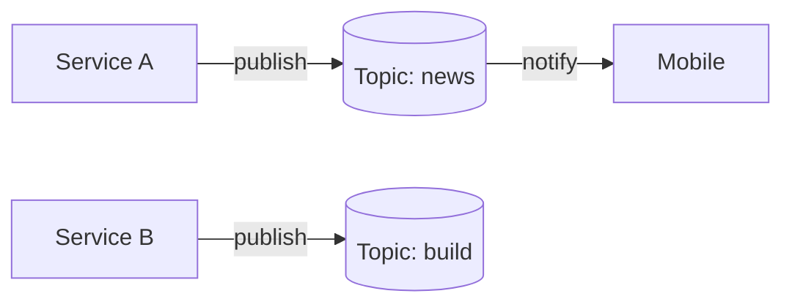

หลายคนที่เคยใช้งาน AI Agent ผ่าน IDE หรือ CLI น่าจะเคยเจอปัญหาเดียวกันอยู่บ่อย ๆ

เวลาที่เราสั่งให้มันทำงานสักอย่างหนึ่ง ไม่ว่าจะเป็นการ generate โค้ด, refactor โปรเจกต์, หรือรัน task ใหญ่ๆ ก็มักจะต้องรอสักพักกว่างานจะเสร็จ

ระหว่างนั้น เราก็เผลอสลับหน้าจอไปทำอย่างอื่น พอสลับกลับมาเช็กอีกที บางครั้งงานก็ยังไม่เสร็จ แต่บางครั้ง… มันอาจจะเสร็จไปนานแล้ว โดยที่เราไม่รู้ตัวเลย

จะดีกว่าไหม ถ้า AI Agent สามารถเตือนเราได้ทันที เมื่อมันทำงานเสร็จ?

##  แจ้งเตือนเมื่อทำ task เสร็จ

Concept คือทำยังไงให้เราจะสามารถดักจับ event เมื่อ opencode ทำงานเสร็จได้ จากนั้นคำสั่ง ส่งข้อความการแจ้งเตือน

โชคดีที่ opencode ออกแบบระบบให้สามารถเขียน plugin เพิ่มความสามารถเข้าไปได้ โดยภายในระบบก็มีการเตรียม hook สำหรับ event ต่าง ๆ เอาไว้ให้เรียบร้อยแล้ว

เมื่อเข้าใจ concept ของระบบ event และ plugin ของ opencode แล้ว คราวนี้ก็ถึงเวลาลงมือทำจริงกันบ้าง
เราจะเริ่มจากการเขียน plugin สำหรับแจ้งเตือน ขึ้นมาแบบง่ายที่สุด

สร้างไฟล์ plugin ที่ path ดังต่อไปนี้ `~/.config/opencode/plugin/notify.ts`

``` typescript
import type { Plugin } from "@opencode-ai/plugin";

export const NotificationPlugin: Plugin = async ({
	project,
	client,
	$,
	directory,
	worktree,
}) => {

return {
		event: async ({ event }) => {
		// Send notification on session completion
			if (event.type === "session.idle") {
				const message = `\nOpencode [${directory}] Session completed`;
				
				await notifyLocal($, message);
			}
		},
	};
};

const notifyLocal = async ($: any, message: string): Promise<void> => {
	await $`osascript -e 'display notification "${message}" with title "opencode"'`;
};
```

ลองทดสอบการแจ้งเตือนง่ายๆ ด้วยข้อความทักท้าย (เพื่อให้ opencode ทำงานเสร็จเร็วๆ)


> เมื่อ task สำเร็จจะเห็นว่ามันมีการแจ้งเตือนที่คอมของเราแล้ว

แต่ถ้าเราไม่ได้อยู่ในหน้าจอคอมหล่ะทำยังไง?

คำตอบง่าย ๆ เลยคือ ก็ส่งแจ้งเตือนเข้าโทรศัพท์ด้วย ไม่ว่าจะเป็น ช่องทาง Line, Discord หรือ Telegram ก็ได้ตามที่ถนัด

> แต่ planform พวกนี้เวลา login ผ่านคอมบางทีมันแจ้งเตือนที่คอม แต่ไม่แจ้งเตือนในมือถือเลยไม่ตอบโจทย์สำหรับผม

ผมเลยจะขอแนะนำแอปตัวหนึ่งที่ใช้ง่ายมาก และเหมาะกับสาย dev สุด ๆ
## NTFY

เป็นแอปสำหรับส่งแจ้งเตือนไปยังมือถือหรือคอมพิวเตอร์ ผ่านการเรียก HTTP request แบบตรงไปตรงมา

### Pub–Sub Concept

แนวคิดของ ntfy จะอยู่บนรูปแบบ **Publish / Subscribe (Pub–Sub)**



ลองนึกภาพง่าย ๆ แบบนี้

- เรา **subscribe** topic ชื่อ news
    
- เมื่อมี service ใดก็ตามส่ง notification เข้ามาที่ topic news
    
- มือถือของเราจะได้รับแจ้งเตือนทันที
    

แต่ถ้ามีการส่ง notification ไปที่ topic อื่น เช่น build, alert หรือ random เราจะ **ไม่ได้รับการแจ้งเตือนเลย** เพราะเราไม่ได้ subscribe topic เหล่านั้นไว้

เปิดใช้งาน app จะพบกับหน้าจอ Subscribed topics ให้กดปุ่ม `+` เพื่อเพิ่ม topic ที่ต้องการรับแจ้งเตือน


 กรอกชื่อ topic แล้วกดปุ่ม Subscribe


> แนะนำให้ตั้งชื่อที่คิดว่าจะไม่ซ้ำกับคนอื่น เพราะใน version free topic เราจะไม่สามารถตั้งเป็น private ได้ทำให้คนอื่นสามารถ publish และ subscribe ได้เหมือนกัน

ทำการลองส่ง curl เพื่อทดสอบว่าข้อมูลแจ้งเตือนเข้ามือถือไหม

```bash
curl -d "งานเสร็จแล้ว ✅" https://ntfy.sh/my_topic
```

เมื่อเราตั้งค่า NTFY เสร็จแล้ว มาปรับ script plugin notify กันต่อเพื่อให้มันส่งแจ้งเตือนไปยังคอม และมือถือ

``` typescript
import type { Plugin } from "@opencode-ai/plugin";

export const NotificationPlugin: Plugin = async ({
  project,
  client,
  $,
  directory,
  worktree,
}) => {
  return {
    event: async ({ event }) => {
      // Send notification on session completion
      if (event.type === "session.idle") {
        const message = `Opencode [${directory}] session completed`;

        await Promise.all([
          notifyLocal($, message),
          notifyToIphone("my-opencode-notify", message),
        ]);
      }
    },
  };
};

const notifyLocal = async ($: any, message: string): Promise<void> => {
  await $`
    osascript -e 'display notification "${message}" with title "opencode"'
  `;
};

const notifyToIphone = async (
  topic: string,
  message: string,
): Promise<void> => {
  await fetch(`https://ntfy.sh/${topic}`, {
    method: "POST",
    headers: {
      "Content-Type": "text/plain",
    },
    body: message,
  });
};
```

แต่ไหนๆ จะไม่ต้องเฝ้าจอ ถ้าไม่ต้องอยู่หน้าคอม แล้วสั่งงานผ่านมือถือได้ด้วยก็น่าจะดีนะ ...

## สั่งงานผ่านมือถือ
ใน opencode มี feature ที่ทำการรัน opencode แบบ server ได้ด้วย ซึ่งสามารถใช้ผ่าน browser ได้เลย 

### เปิด Opencode server

ทำการรัน opencode server ด้วยคำสั่ง

``` bash
opencode serve --port 4555 --hostname 0.0.0.0
```

ทดสอบเข้าใช้งานผ่าน browser

แต่ข้อเสียของ OpenCode Server คือ UI ยังไม่ค่อย responsive เท่าไร

เมื่อเข้าใช้งานผ่านมือถือจะค่อนข้างลำบาก บางปุ่มกดไม่ได้ หรือโดน element อื่นบัง ทำให้ใช้งานจริงไม่สะดวก

โชคดีที่มีคนเจอปัญหานี้เหมือนกันเลยพัฒนา client ที่ optmize UI สำหรับการใช้งานบนมือถือโดยเฉพาะ

### OpenCode Portal

OpenCode Portal คือ web client สำหรับ OpenCode ที่ออกแบบมาโดยโฟกัสที่การใช้งานบน mobile เป็นหลัก

เหมาะมากสำหรับคนที่อยากสั่งงานหรือเช็กสถานะของ OpenCode จากมือถือโดยตรง

#### วิธีรัน OpenCode Portal

ทดลองรันผ่าน docker

``` bash
docker run -p 3000:3000 \
  -e OPENCODE_SERVER_URL=http://host.docker.internal:4555 \
  ghcr.io/hosenur/portal:latest
````

ทดสอบเข้าใช้งานผ่าน browser

ตอนนี้ยังสามารถเข้าถึงได้แค่ network เดียวกันอยู่ แต่ถ้าเราใช้พวก Cloudflare tunnel หรือ Tailscale ก็สามารถสั่งงานจากนอกบ้านได้เลย

> แต่อาจจะระวังเรื่อง security นิดนึงเพราะถ้าสามารถเข้าถึง การใช้งาน opencode ได้จากภายนอกโดยไม่มี Authentication ก็อาจจะโดนมารัน script แปลกๆในคอมเราก็ได้

หวังว่าบทความนี้จะช่วยให้การใช้งาน opencode ของคุณง่ายขึ้น และทำให้ชีวิตการเขียนโค้ดสบายขึ้น

ไว้เจอกันใหม่ในบทความหน้า สวัสดีครับ

**Ref**

- https://opencode.ai/docs
- https://ntfy.sh/
- https://github.com/hosenur/portal