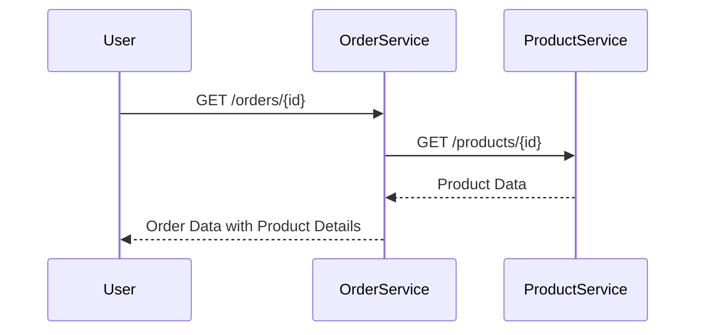
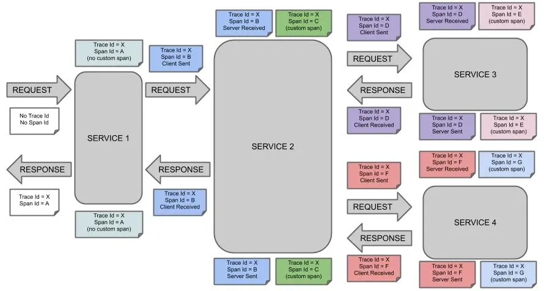

ในโลกของการพัฒนา Software เราไม่เพียงแต่สร้าง Software ให้ใช้งานได้ แต่เรายังต้องคิดถึงการดูแลรักษาด้วยโดยในบทความนี้เพื่อให้ทุกคนเข้าใจเรื่อง Observability เราลองมาเข้าใจปัญหากันก่อนดีกว่าครับ

## POC

สมมติเราพัฒนาระบบ 2 Service ทำงานร่วมกันดังต่อไปนี้

**1. `Product Service` ใช้สำหรับจัดการข้อมูลสินค้าต่าง ๆ (เช่น ชื่อ, ราคา, รายละเอียดสินค้า)**

**2. `Order Service` ใช้สำหรับจัดการคำสั่งซื้อ (เช่น รายการสินค้าในคำสั่งซื้อ, ราคาสรุป)**

เมื่อผู้ใช้เรียก API จาก Order Service เพื่อตรวจสอบข้อมูลคำสั่งซื้อ Order Service จำเป็นต้อง ดึงข้อมูลสินค้า เพิ่มเติมจาก Product Service เพื่อแสดงรายละเอียดสินค้าในคำสั่งซื้อ



ในช่วงแรก ระบบอาจทำงานได้ปกติดี แต่ถ้าเกิดสถานการณ์ดังต่อไปนี้ล่ะ

- API เกิด Error แต่ไม่รู้ว่าปัญหามาจาก Service ไหน
- API ทำงานช้า แต่ไม่แน่ใจว่าความช้านั้นเกิดจาก Code, Database, หรือการสื่อสารระหว่าง Service

เราจะระบุสาเหตุและแก้ไขปัญหาได้อย่างไร?


ดังนั้น Hero ที่จะเข้ามาช่วยแก้ไขปัญหานี้ก็คือ Observability นั่นเองครับ! ✨

## Observability


Observability หมายถึง “ความสามารถในการสังเกต” หรือ “การวัดผลได้”

หรือถ้าอธิบายง่ายๆ ก็เหมือนการติดกล้องวงจรปิดให้กับระบบคอมพิวเตอร์ เพื่อให้เรารู้ว่ามันกำลังทำอะไร มีปัญหาตรงไหน โดยไม่ต้องเข้าไปเปิดดูข้างใน

> ถ้าเราสามารถดูพฤติกรรมของสิ่งต่าง ๆ เช่น ความเร็ว หรืออุณหภูมิของเครื่องจักร เราก็สามารถรู้ได้ว่าเครื่องจักรกำลังทำงานปกติหรือมีปัญหาอยู่ที่ไหน

## Observability ในบริบทของ Software Development

Observability ในบริบทของ Software Development หมายถึงความสามารถในการเข้าใจสถานะภายในของระบบ Software (เช่น Application หรือระบบ Network) โดยการวิเคราะห์ผลลัพธ์ที่ระบบสร้างออกมา เช่น logs, metrics, และ traces

ส่ิงเหล่านี้ช่วยให้:

- นักพัฒนาและทีม DevOps สามารถตรวจสอบปัญหา ระบุสาเหตุของปัญหาได้ง่ายขึ้น
- นักพัฒนาและทีม DevOps นำ Feedback ที่ได้จาก Observability มาวิเคราะห์ประสิทธิภาพการทำงาน เพื่อปรับปรุงระบบให้ดียิ่งขึ้น

## 3 เสาหลักของ Observability

### 1. **Logs** (บันทึกเหตุการณ์)

เป็นข้อความที่บันทึกเหตุการณ์ต่าง ๆ ในระบบ เช่น การทำงานที่สำเร็จ หรือข้อผิดพลาดที่เกิดขึ้น ซึ่งข้อมูลเหล่านี้จะช่วยให้นักพัฒนาเข้าใจปัญหาเชิงลึก เช่น Function หรือคำสั่งใดที่ทำงานผิดพลาด

**ตัวอย่างข้อมูล Logs**

```
2024-11-29 11:25:14 ERROR - File upload failed: File too large
2024-11-29 11:25:15 ERROR - File not found: /uploads/resume.pdf
2024-11-29 11:25:17 ERROR - Database connection failed: Timeout
2024-11-29 11:25:18 ERROR - Authentication failed: Incorrect password
2024-11-29 11:25:19 ERROR - Payment failed: Insufficient funds
```

### 2. **Metrics** (ตัวชี้วัด)

ข้อมูลเชิงตัวเลขที่เก็บสถานะหรือประสิทธิภาพของระบบ เช่น การใช้งาน CPU, Memory, หรือจำนวน Request HTTP ซึ่งข้อมูลเหล่านี้จะช่วยวิเคราะห์แนวโน้มและประสิทธิภาพของระบบ เช่น ตรวจจับว่า Service นี้ใช้ CPU ไปเท่าไร

**ตัวอย่างข้อมูล Metrics**

- การใช้งาน CPU = 80%
- จำนวน Request HTTP ต่อวินาที = 200

### 3. **Traces** (การติดตามการทำงาน)

การบันทึกเส้นทางที่คำขอหรือการทำงานไหลผ่านระบบ โดยเฉพาะในระบบแบบกระจาย (Distributed Systems)
ซึ่งข้อมูลเหล่านี้ช่วยให้นักพัฒนาเห็นภาพรวมการทำงาน เช่น ตรวจหาจุดคอขวดที่ทำให้ API นี้ทำงานช้า หรือจุดที่เกิดข้อผิดพลาด

โดยในเรื่องนี้จะมี 2 แนวคิดหลักดังต่อไปนี้

#### Span (ช่วงการทำงาน)

คือหน่วยพื้นฐานของการติดตามการทำงาน
เปรียบเหมือนการจับเวลาในแต่ละขั้นตอนการทำงาน
เก็บรายละเอียดต่างๆ เช่น คำอธิบายและเวลาการทำงานตั้งแต่เริ่มจนจบ

> โดยทั่วไปการส่ง Request ไปยัง Service อื่น ถือเป็น 1 Span หรือการเรียก Database หรือ Function ก็อาจจะถือเป็น 1 Span ขึ้นอยู่การตั้งค่าของผู้ใช้งาน

#### Trace (การติดตามทั้งหมด)

คือชุดของ Spans ที่เชื่อมโยงกันเป็นโครงสร้างแบบต้นไม้
ติดตามการทำงานทั้งหมดใน 1 Request

**ตัวอย่างข้อมูล Traces**



ภาพนี้แสดงการติดตามการทำงานในระบบกระจาย (Distributed System) โดยใช้แนวคิดของ Spans และ Traces โดยใน Diagram นี้จะยกตัวอย่าง Use case ซึ่งมี 4 Service ที่ทำงานเชื่อมโยงกันโดยมีลำดับการทำงานดังนี้

1. เมื่อมีการ Request ไปยัง Service 1 จะสร้าง Trace ID X และสร้าง Span A
2. จากนั้น Service 1 Request ไปยัง Service 2 จะทำการสร้าง Span B
3. ภายใน Service 2 มีการระบุการสร้าง Custom span (อาจจะเป็นการจับเวลาในการ Query database) Service 2 จึงสร้าง Span C
4. จากนั้น Service 2 Request ไปยัง Service 3 และ Service 4 จึงมีการสร้าง Span D และ Span F
5. ภายใน Service 3 มีการระบุการสร้าง Custom span Service 3 จึงสร้าง Span E
6. ภายใน Service 4 มีการระบุการสร้าง Custom span Service 4 จึงสร้าง Span G
7. เมื่อ Service ทั้งหมดทำงานเสร็จจึง Return ค่า Response ไปหา Client ตามมลำดับ

> การติดตามทั้งหมดจะใช้ Trace ID เป็นตัวเชื่อมโยง โดยสามารถสังเกตได้ว่าแต่ละ Span มีการส่งต่อ Trace ID และ Span ID ไปยัง Service ถัดไป เพื่อให้สามารถติดตามการทำงานของระบบนั้นๆ ได้อย่างสมบูรณ์


เพื่อให้เห็นภาพเราอาจจะเปรียบเทียบว่า Trace ID เป็นเส้นทางการเดินทางทั้งหมดและในเส้นทางนี้มีจุด Checkpoint 2 จุดได้แก่ Span 1 และ Span 2

เมื่ออ่านมาถึงตรงนี้แล้ว 🎉 คิดว่าทุกคนน่าจะเห็นภาพของ Observability กันมากขึ้นนะครับ บทความหน้าเรามาลองทำ LAB implement เรื่องนี้กัน แล้วพบกันใหม่ครับ สวัสดีครับ! 🙌

Ref:

- https://docs.spring.io/spring-cloud-sleuth/docs/2.2.x-SNAPSHOT/reference/html/
- https://www.crowdstrike.com/en-us/cybersecurity-101/observability/three-pillars-of-observability/
