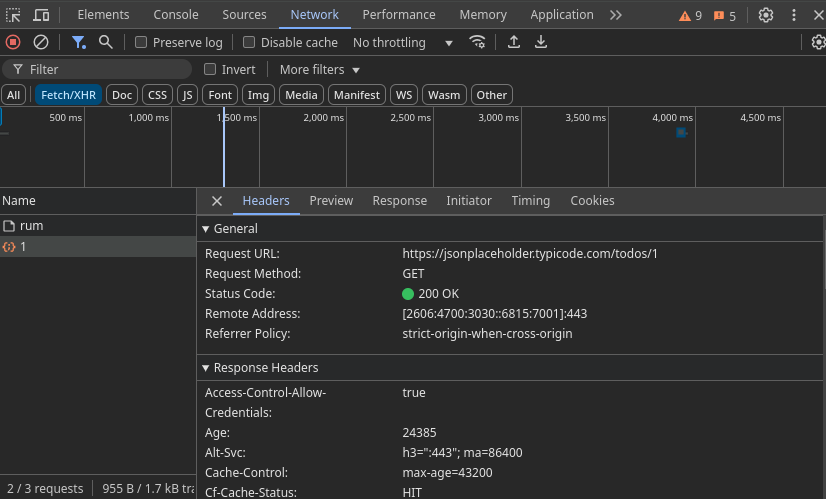

เมื่อเราต้องเชื่อมต่อกับ API ภายนอกโดยใช้ HTTP request เราจะมั่นใจได้อย่างไรว่าข้อมูลที่เราส่งไปนั้นถูกต้อง? เช่น Payload, Header ที่ส่งไป

เบื้องต้นผมจะลองสาธิตการ Debug HTTP request โดยใช้ ภาษา JAVA

วิธีที่ง่ายที่สุดคือการเพิ่ม Log ใน Code เช่นตัวอย่างนี้

```java
import org.slf4j.Logger;
import org.slf4j.LoggerFactory;
import org.springframework.http.HttpHeaders;
import org.springframework.http.MediaType;
import org.springframework.web.client.RestClient;
import org.springframework.http.ResponseEntity;

public class ApiService {
    private static final Logger logger = LoggerFactory.getLogger(ApiService.class);
    private final RestClient restClient = RestClient.create();

    public void callApi() {
        String url = "https://jsonplaceholder.typicode.com/posts";
        String requestBody = """
                {
                    "title": "foo",
                    "body": "bar",
                    "userId": 1
                }
                """;

        // Log request
        logger.info("Sending request to URL: {}", url);
        logger.info("Headers: Content-Type=application/json");
        logger.info("Body: {}", requestBody);

        ResponseEntity<String> response = restClient.post()
                .uri(url)
                .header(HttpHeaders.CONTENT_TYPE, MediaType.APPLICATION_JSON_VALUE)
                .body(requestBody)
                .retrieve()
                .toEntity(String.class);

        // Log response
        logger.info("Response Status Code: {}", response.getStatusCode());
        logger.info("Response Body: {}", response.getBody());
    }

    public static void main(String[] args) {
        new ApiService().callApi();
    }
}

```

เพียงเท่านี้เราก็สามารถ Debug HTTP request ฝั่ง Backend ได้แล้ว

> แต่เดี๋ยวก่อนจะดีกว่าไหม? ถ้าเราสามารถ Debug โดยไม่ต้องแก้ Code แล้วใส่ Log ไปในทุกๆ Logic ที่มีการเรียก HTTP request

ถ้าใครเคยทำงานฝั่ง Frontend คงจะคุ้นเคยกับ Dev tool ในส่วนของ Tab network ที่สามารถ Debug HTTP request ที่ส่งจาก Web browser ได้



ซึ่ง Tool ตัวนี้มีประโยชน์มากในการ Debug เพื่อหาข้อผิดพลาดที่เกิดจากการ Call HTTP request

## Proxy คืออะไร

Proxy เป็นตัวกลางที่ช่วยจัดการการส่งข้อมูลระหว่าง Client และ Server โดยผมจะอธิบายหลักการ การทำงานของ Proxy เบื้องต้นดังนี้


จาก Diagram เราจะสังเกตุได้ว่าเราจะ Call HTTP request ไปที่ Proxy แทนการ Call HTTP request โดยตรงจากนั้น Proxy จะเป็นคนติดต่อกับ Server ปลายทางแทนเราเอง

> ซึ่งเราจะสามารถใช้ Proxy ดักจับ Request และบันทึกข้อมูลเอาไว้ Debug ภายหลังได้

## Mitmproxy

Mitmproxy เป็นเครื่องมือที่ช่วยสร้าง Proxy ให้เราสามารถดักจับ, และตรวจสอบ HTTP request ได้อย่างง่ายดาย

โดยในบทความนี้เราจะลองมาใช้ Mitmproxy ในการดักจับ Request เพื่อใช้ในการ Debug กันครับ

### การติดตั้ง Mitmproxy

สำหรับ MacOS สามารถ ใช้ Brew เพื่อติดตั้ง Mitmproxy ได้ดังนี้

```bash
brew install mitmproxy
```

ส่วน OS อื่นๆสามารถ ดูวิธีการติดตั้งเพิ่มเติมได้ทาง Link ดังต่อไปนี้ [https://docs.mitmproxy.org/stable/overview-installation/](https://docs.mitmproxy.org/stable/overview-installation/)

### เริ่มต้นใช้งาน Proxy

เปิดใช้งาน mitmproxy โดยใช้คำสั่ง

```bash
mitmproxy
```

จะปรากฏหน้า Console ของ Mitmproxy


### ทดสอบการใช้งาน Proxy

เราสามารถทดสอบโดยใช้ CURL และกำหนดให้ Request ผ่าน Proxy ที่รันอยู่บน 127.0.0.1:8080 ดังนี้

```bash
http_proxy=http://127.0.0.1:8080/ curl http://example.com/
```

หากทุกอย่างถูกต้อง คุณจะเห็นข้อมูล Request แสดงบน Console


จากรูปจะสังเกตุว่า มี Log ในการ Call HTTP request ไปยัง [http://www.example.com](http://www.example.com)

โดยเราสามารถดูรายละเอียดของ Request โดยการกดปุ่ม `Enter` จะปรากฎรายละเอียดของ Request ดังรูป


ซึ่งถ้าเราอยากดูข้อมูลใน Tab อื่นๆเช่น Response สามารถกดปุ่ม `→` , `←` เลื่อน Tab ได้


จากตัวอย่างเราจะเห็นได้ว่าเราสามารถดักจัก Request จาก CURL ได้แล้ว 🎉

## ใช้ Mitmproxy ร่วมกับ JAVA

โดยในขั้นตอนนี้ผมจะยกตัวอย่างการเรียก HTTP request ในภาษา JAVA และ Debug ด้วย Mitmproxy

ก่อนอื่นเตรียม Code ในการเรียก API ดังนี้

```java
import org.springframework.http.HttpHeaders;
import org.springframework.http.MediaType;
import org.springframework.web.client.RestClient;
import org.springframework.http.ResponseEntity;

public class ApiService {
    private final RestClient restClient = RestClient.create();

    public void callApi() {
        String url = "https://jsonplaceholder.typicode.com/posts";
        String requestBody = """
                {
                    "title": "foo",
                    "body": "bar",
                    "userId": 1
                }
                """;

        ResponseEntity<String> response = restClient.post()
                .uri(url)
                .header(HttpHeaders.CONTENT_TYPE, MediaType.APPLICATION_JSON_VALUE)
                .body(requestBody)
                .retrieve()
                .toEntity(String.class);
    }

    public static void main(String[] args) {
        new ApiService().callApi();
    }
}
```

ใช้คำสั่ง Keytool เพื่อเพิ่ม Certificate ที่ Mitmproxy ใช้ลงใน Java Truststore

```bash
sudo keytool -importcert -alias mitmproxy -storepass changeit -keystore $JAVA_HOME/lib/security/cacerts -trustcacerts -file ~/.mitmproxy/mitmproxy-ca-cert.pem
```

เปิดใช้งาน mitmproxy โดยใช้คำสั่ง

```bash
Mitmproxy
```

### การ ตั้งค่า VM Option

โดย Default JAVA จะสามารถตั้งค่า HTTP proxy ได้ผ่านทาง VM Option ซึ่งในขั้นตอนนี้ผมจะสาธิตการตั้งค่า VM Option ด้วย IDE intelij

ไปที่เมนู `RUN > Edit configurations` จะปรากฎเมนูการตั้งค่าการ Run ดังภาพ


คลิกที่เมนู `Modify options > Add VM options` เพื่อทำการกำหนด VM options ในการ Run class


จากรูปจะสังเกตุเห็น Input VM options ในส่วนของ Build and run ให้ใส่ VM option ดังนี้

```bash
-Dhttp.proxyHost=127.0.0.1 -Dhttp.proxyPort=8080 -Dhttps.proxyHost=127.0.0.1 -Dhttps.proxyPort=8080
```

เมื่อตั้งค่าเสร็จแล้วให้คลิกที่ปุ่ม OK เพื่อ Save config จากนั้นทำการ Run class ApiService

จะพบว่า Console mitmproxy จะ ปรากฎรายละเอียดการ Call request ไปยัง https://jsonplaceholder.typicode.com/posts


การ Debug HTTP request ฝั่ง Backend ไม่ยากอย่างที่คิดเลยใช่ไหมครับ? ลองเอาเทคนิคเหล่านี้ไปปรับใช้กันดูนะครับ แล้วพบกันใหม่โอกาสหน้า สวัสดีครับ! 🙌

Ref:

- https://docs.mitmproxy.org/stable
- https://stackoverflow.com/questions/120797/how-do-i-set-the-proxy-to-be-used-by-the-jvm
