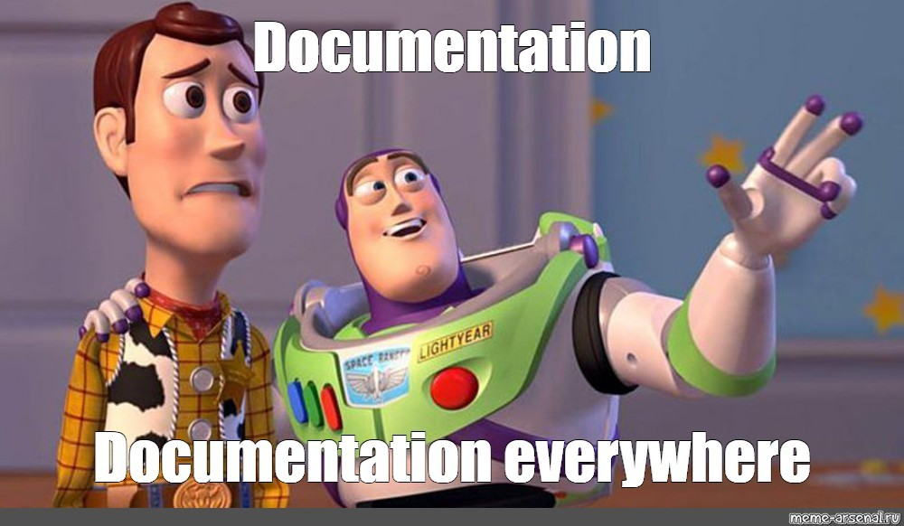

เมื่อเราเริ่มพัฒนา API Server ไม่ว่าจะเพื่อให้ Frontend หรือ Third-party เข้ามาเชื่อมต่อกับระบบ สิ่งสำคัญที่ขาดไม่ได้คือ **เอกสาร API Specification** เพื่อระบุว่า API ของเรามี Endpoint อะไรบ้าง รับส่งข้อมูลอย่างไร และต้องใช้รูปแบบใดในการเรียกใช้งาน



ในอดีต เราอาจต้องเขียนเอกสาร API ด้วยมือ ซึ่งใช้เวลานาน และเสี่ยงต่อการหลุดข้อมูลเมื่อโค้ดมีการเปลี่ยนแปลง แต่คงจะดีไม่น้อยถ้าเราสามารถ **Generate API Spec อัตโนมัติจากโค้ดจริงได้เลย**

ในบทความนี้ผมจะมาแนะนำการสร้างเอกสาร API ด้วย Spring Boot และ OpenAPI พร้อมตัวอย่างการใช้งานแบบรวดเร็ว (POC) รวมถึงการเปลี่ยน UI แสดงผล API Spec จาก Swagger ไปเป็น Redoc และ Scalar ครับ

## ทดลองสร้าง API Spec แบบเร็วๆ

1. สร้าง Project Spring boot โดยใช้ [https://start.spring.io](https://start.spring.io) จากนั้นทำการเลือก Dependencies Spring Web, Lombok


2. เพิ่ม Dependency สำหรับ OpenAPI + Swagger UI

```kotlin
implementation("org.springdoc:springdoc-openapi-starter-webmvc-ui:2.8.6")
```

> springdoc-openapi-starter-webmvc-ui จะช่วยให้เราสามารถ Generate API Spec ตามมาตรฐาน OpenAPI และแสดงผลผ่าน Swagger UI ได้ทันที

3. สร้าง API เบื้องต้นด้วยการสร้างไฟล์ดังต่อไปนี้

`CreateTestDto.java`

```java
package com.example.api_docs;

public record CreateTestDto(
        String name
) {
}
```

`TestController.java`

```java
package com.example.api_docs;

import org.springframework.stereotype.Controller;
import org.springframework.web.bind.annotation.*;

import java.util.List;

@RestController
@RequestMapping("api/test")
public class TestController {
    @PostMapping
    public Long create(@RequestBody CreateTestDto req) {
        return 1L;
    }

    @GetMapping
    public List<String> get() {
        return List.of("test1", "test2");
    }

    @GetMapping("{id}")
    public String get(@PathVariable Long id) {
        return "test1";
    }

    @PutMapping
    public void edit(@RequestBody CreateTestDto req) {

    }

    @DeleteMapping("{id}")
    public void delete(@PathVariable Long id) {

    }

}

```

4. เปิดดู Swagger UI

หลังจากรันโปรเจกต์แล้ว เข้า URL: [http://127.0.0.1:8080/swagger-ui/index.html](http://127.0.0.1:8080/swagger-ui/index.html)

หากทุกอย่างถูกต้อง คุณจะเห็นหน้า Swagger UI ดังภาพ


5. เปลี่ยน Path ของ Swagger UI (Optional)

ถ้าต้องการเปลี่ยน Path เรียก Swagger UI ให้เพิ่ม properties ต่อไปนี้ลงไปในไฟล์ application.properties

```
springdoc.swagger-ui.path=/api-spec.html
```

> สามารถดูการตั้งค่าเพิ่มเติมได้ที่ [https://springdoc.org/#properties](https://springdoc.org/#properties)

Springdoc ทำให้เราสร้างเอกสาร API ได้สะดวกมากขึ้น แต่จริงๆ แล้วเบื้องหลังทั้งหมดนี้ขับเคลื่อนโดยสิ่งที่เรียกว่า OpenAPI มาดูกันครับว่า OpenAPI คืออะไร และเกี่ยวข้องกับ Swagger อย่างไร

## Open API

OpenAPI (เดิมชื่อ Swagger Specification) คือ **มาตรฐานกลางในการอธิบาย RESTful API** ด้วยรูปแบบไฟล์ JSON หรือ YAML โดยสามารถใช้สร้างเอกสาร, ทดสอบ API, หรือแม้แต่ Generate Code ได้

## Swagger

Swagger คือชุดเครื่องมือที่ช่วยในการจัดการ OpenAPI Specification เช่น:

- **Swagger Editor** – เขียนและแก้ไขไฟล์ OpenAPI
- **Swagger UI** – แสดงผล API Spec บนเว็บให้เข้าใจง่าย
- **Swagger Codegen** – สร้าง Client SDK หรือ Server Stub จาก Spec

โดยในบทความนี้ เราใช้ springdoc-openapi ซึ่งสามารถ Generate ทั้ง API Spec และ Swagger UI ให้เราโดยอัตโนมัติ

## **เปลี่ยนจาก Swagger UI ไปใช้ UI อื่นๆ (Optional)**

ถ้าอยากลอง UI ตัวอื่นที่หน้าตาทันสมัยขึ้น ผมมีตัวเลือกที่น่าสนใจมาแนะนำกันครับ เรามาเริ่มที่ **Redoc** กันก่อนเลย

### Redoc

1. สร้างไฟล์ `src/main/resources/static/redoc.html`

```html
<!DOCTYPE html>
<html>
  <head>
    <title>Redoc</title>
    <!-- needed for adaptive design -->
    <meta charset="utf-8" />
    <meta name="viewport" content="width=device-width, initial-scale=1" />
    <link
      href="https://fonts.googleapis.com/css?family=Montserrat:300,400,700|Roboto:300,400,700"
      rel="stylesheet"
    />

    <!--
    Redoc doesn't change outer page styles
    -->
    <style>
      body {
        margin: 0;
        padding: 0;
      }
    </style>
  </head>
  <body>
    <redoc spec-url="/v3/api-docs"></redoc>
    <script src="https://cdn.redoc.ly/redoc/latest/bundles/redoc.standalone.js"></script>
  </body>
</html>
```

2. เปิดดู Redoc

หลังจากรันโปรเจกต์แล้ว เข้า URL: [http://127.0.0.1:8080/redoc.html](http://127.0.0.1:8080/redoc.html)

หากทุกอย่างถูกต้อง คุณจะเห็นหน้า Redoc ดังภาพ


### Scalar

1. สร้างไฟล์ `src/main/resources/static/scalar.html`

```html
<!DOCTYPE html>
<html>
  <head>
    <title>Scalar API Reference</title>
    <meta charset="utf-8" />
    <meta name="viewport" content="width=device-width, initial-scale=1" />
  </head>
  <body>
    <script id="api-reference" data-url="/v3/api-docs"></script>
    <script src="https://cdn.jsdelivr.net/npm/@scalar/api-reference"></script>
  </body>
</html>
```

2. เปิดดู Scalar

หลังจากรันโปรเจกต์แล้ว เข้า URL: [http://127.0.0.1:8080/scalar.html](http://127.0.0.1:8080/scalar.html)

หากทุกอย่างถูกต้อง คุณจะเห็นหน้า Scalar ดังภาพ


## ปิดการใช้งาน Swagger UI (Optional)

หากคุณต้องการ **ไม่ใช้ Swagger UI เลย** ให้เปลี่ยน dependency จาก

```
org.springdoc:springdoc-openapi-starter-webmvc-ui
```

เป็น

```
org.springdoc:springdoc-openapi-starter-webmvc-api
```

เพื่อให้ Springdoc Generate API Spec เท่านั้นโดยที่ไม่สร้าง Swagger UI

การจัดการเอกสาร API ไม่ใช่เรื่องน่าเบื่ออีกต่อไปแล้วครับ แค่ใช้เครื่องมือให้ถูก ก็ช่วยลดงาน Manual ไปได้เยอะเลย หวังว่าบทความนี้จะช่วยให้คุณเริ่มต้นได้ง่ายขึ้นนะครับ แล้วเจอกันใหม่บทความหน้า สวัสดีครับ! 🚀

หากใครอยากลองเล่นหรือดูโค้ดเต็มๆ ว่าผมเซ็ตอะไรไว้บ้าง สามารถเข้าไปดูได้ที่ GitHub repository นี้เลยครับ [http://github.com/larb26656/spring-boot-open-api](http://github.com/larb26656/spring-boot-open-api)

Ref:

- [SpringDoc](https://springdoc.org)
- [OpenAPI Initiative](https://www.openapis.org)
- [ReDocly](https://redocly.com)
- [Scalar](https://scalar.com)
