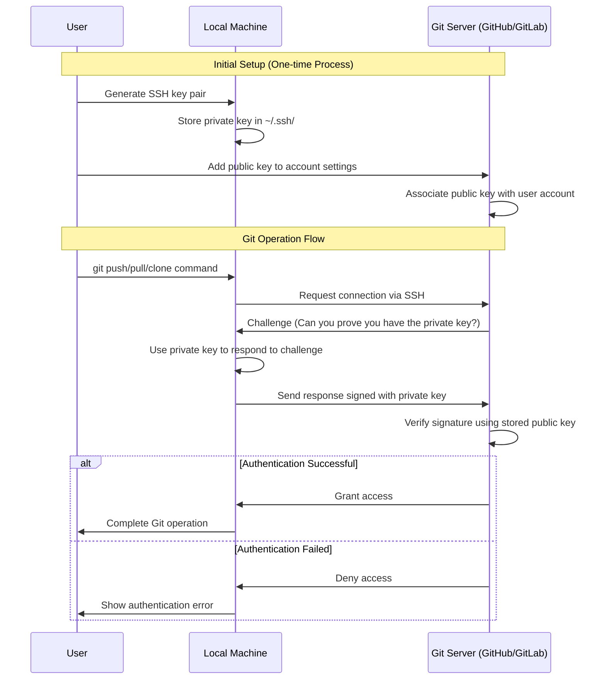

เมื่อใช้งาน Git ผ่าน Command Line เรามักจะต้องกรอก Password ทุกครั้งที่มีการ Push, Pull หรือ Clone ซึ่งนอกจากจะไม่สะดวกแล้ว การบันทึก Password ไว้ในเครื่องก็อาจมีความเสี่ยงด้านความปลอดภัย

บทความนี้จะแนะนำวิธีการใช้ SSH key เพื่อ Authenticate กับ Git Server โดยไม่ต้องกรอก Password ทุกครั้ง

## Create SSH Key

1. ตรวจสอบว่าเคยมี SSH Key หรือยัง

เปิด Terminal และรันคำสั่ง:

```bash
ls -al ~/.ssh
```

หากคุณเห็นไฟล์ชื่อ `id_rsa` และ `id_rsa.pub` แสดงว่าคุณมี SSH key อยู่แล้ว สามารถข้ามไปยังขั้นตอนที่ 3 ได้เลย

2. สร้าง SSH Key ใหม่

```bash
ssh-keygen -t ed25519 -C "your_email@example.com"
```

หากเครื่องของคุณไม่รองรับ ed25519 ให้ใช้ rsa แทน:

```bash
ssh-keygen -t rsa -b 4096 -C "your-email@example.com"
```

ระบบจะถามว่าให้สร้างไฟล์ไว้ที่ไหน ให้กด Enter เพื่อใช้ตำแหน่งเริ่มต้น (~/.ssh/id_ed25519)

### ควรใส่ Passphrase ไหม?

- หากต้องการความปลอดภัยสูงสุด ควรตั้ง Passphrase
- หากไม่ต้องการใส่ Password ทุกครั้ง ให้กด Enter เพื่อข้ามขั้นตอนนี้

## วิธีการทำงานของ SSH Authentication ใน Git

ก่อนที่จะไปเชื่อม SSH key กับ Git เรามาดูกันว่า SSH ทำงานกับ Git ยังไงกันแน่ ทำไมถึงสะดวกและปลอดภัยกว่าการใส่ Password ทุกครั้ง แผนภาพนี้จะช่วยให้เข้าใจภาพรวมการทำงานได้ง่ายขึ้นครับ



## เชื่อม SSH key กับ Git

1. เพิ่ม Public key ไปยัง Git server

โดยในบทความนี้ผมจะขอยกตัวอย่างการเพิ่ม Public key ลงไปใน Github ส่วน Git provider อื่นๆ ก็จะใช้วิธีคล้ายๆกัน

- เข้าสู่ Github แล้วไปที่เมนู `Settings > SSH and GPG keys`
- คลิกปุ่ม New SSH key เพื่อเพิ่ม key


คัดลอก Public key:

```bash
cat ~/.ssh/id_ed25519.pub
```

2. ตั้งชื่อ Key และวาง Public key ที่คัดลอกมาลงในช่อง Key จากนั้นคลิกปุ่ม "Add SSH Key"


3. ทดลอง Clone Repository

ไปที่ Repository ที่ต้องการ คลิกปุ่ม Clone เลือก Tab SSH แล้วคัดลอก URL ไป Clone:


```bash
git clone git@github.com:<username>/<repository_name>.git
```

หลังจากนี้คุณจะสามารถ Git pull, Git push, Git clone ได้โดยไม่ต้องใส่ Password อีกต่อไป (ตราบใดที่ยังใช้เครื่องเดิมและ Key เดิม)

> หากมีความจำเป็น คุณสามารถ Revoke key เพื่อยกเลิกการเข้าถึงจากเครื่องนั้นๆ ได้

การตั้งค่า SSH อาจดูยุ่งยากในตอนแรก แต่เมื่อเข้าใจหลักการแล้วจะช่วยให้การใช้งาน Git สะดวกขึ้นมาก เพียงตั้งค่าครั้งเดียว คุณก็ไม่ต้องกรอก Password ซ้ำๆ อีกต่อไป แล้วพบกันใหม่ในบทความหน้า สวัสดีครับ! 🚀

Ref:

- [https://docs.github.com/en/authentication/connecting-to-github-with-ssh](https://docs.github.com/en/authentication/connecting-to-github-with-ssh)
