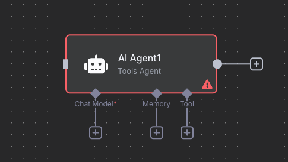

หากคุณใช้งาน n8n และต้องการเชื่อมต่อกับ Model AI ที่ Deploy บน DeepInfra แต่พบว่าไม่มีตัวเลือก DeepInfra โดยตรงใน AI Agent Node วันนี้ผมมีวิธีแก้ปัญหานี้มาฝากครับ

## DeepInfra

DeepInfra เป็นแพลตฟอร์มที่ให้บริการ Deploy และ Host AI models โดยรองรับหลากหลาย Model เช่น Llama, Mistral, Qwen และอื่นๆ โดยที่สำคัญคือ DeepInfra มี API ที่เข้ากันได้กับ OpenAI (OpenAI-compatible API) ซึ่งหมายความว่าสามารถเชื่อม DeepInfra กับบริการที่รองรับ OpenAI ทั้งหมดได้

## วิธีใช้ Model บน DeepInfra กับ n8n

1. สร้าง Workflow ใน n8n

- เพิ่ม Node "AI Agent" เข้าไปใน Workflow ของคุณ

2. เลือก Language Model เป็น "OpenAI Chat Model"

3. เพิ่ม Credential ใหม่ด้วยการกดปุ่ม `+ Create new credential`

4. ตั้งค่า Credential

- นำ API Key จากบัญชี DeepInfra ของคุณมาใส่ในช่อง API Key
- ในช่อง Base URL ให้เปลี่ยนจาก `https://api.openai.com/v1` (ค่าเริ่มต้น) เป็น `https://api.deepinfra.com/v1/openai`

5. เลือก Model ที่ต้องการใช้

เพียงเท่านี้เราก็สามารถใช้ Model AI ที่ Deploy บน DeepInfra ได้แล้ว แล้วพบกันใหม่ในบทความหน้า สวัสดีครับ! 🚀
