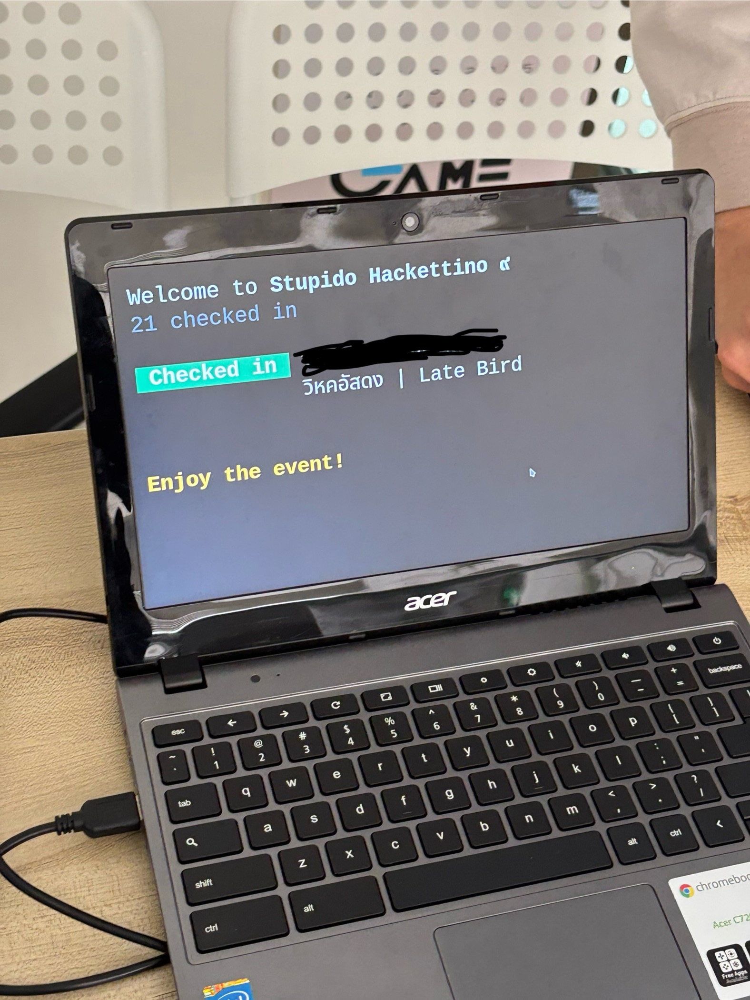
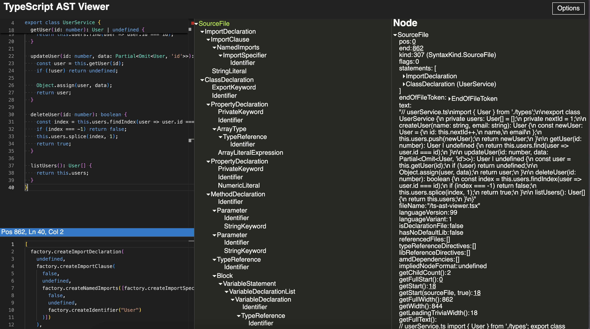
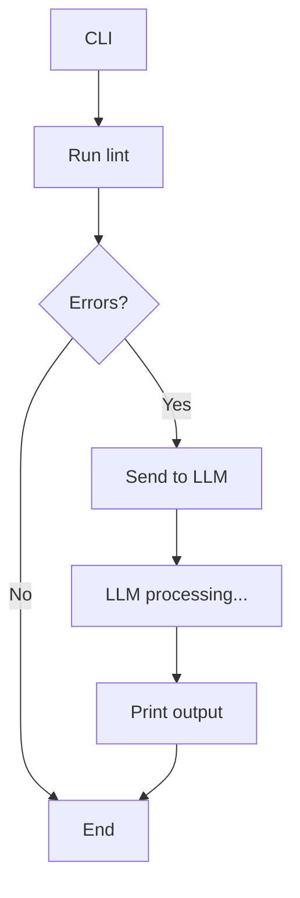
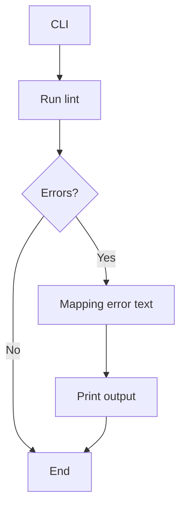
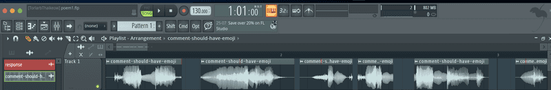
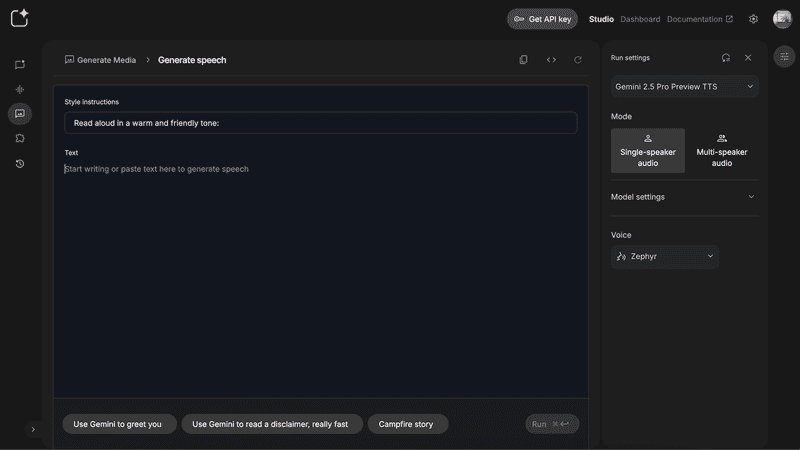
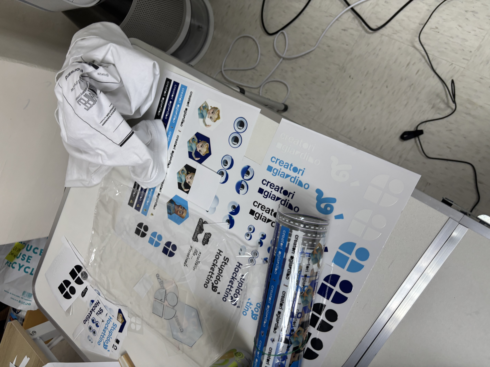
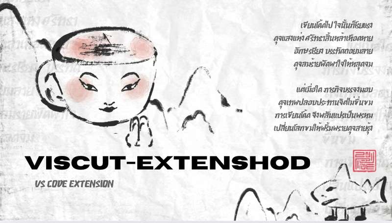

ก่อนอื่นต้องบอกก่อนว่า นี่เป็นครั้งแรกที่ผมได้มีโอกาสมาเข้าร่วมงาน hackathon ก่อนหน้านี้เคยได้ยินมาบ้างว่า hackathon เป็นยังไง จากซีรีส์ชื่อ Start-Up ที่เคยดู
เมื่อผมดูจบ ผมก็รู้สึกอยากไปงานแข่งแบบนี้มากๆ แต่ติดตรงที่ hackathon ส่วนใหญ่ที่จัดกันจะต้องสมัครแบบเป็นทีม ซึ่งผมก็ไม่รุ้จะไปหาทีมจากไหน ประกอบกับ ความไม่กล้าของตัวเอง กลัวไม่เก่งพอเลยพับโปรเจกต์การลองไป hackathon มาหลายปี ...

แต่แล้ววันหนึ่งผมก็นั่งเล่น Facebook ไถฟีดไปเรื่อยๆ แล้วไปเจอ post หนึ่งเข้า


เป็น post เกี่ยวกับการจัดงาน Stupid hackathon ครั้งที่ 9 โดยธีมงานครั้งนี้เป็น Italian brainrot ชื่องานเลยดูแปลกตาไปสักเล็กน้อย ซึ่งก่อนหน้านี้ผมก็เคยเห็นงาน Stupid hackathon ที่ Creatorsgarten จัดมาบ้าง เมื่อเห็น post นี้เลยทำให้นึกย้อนไปว่าตัวเองเคยอยากลองไปแข่ง hackathon สักครั้งนึงดู

## Stupid hackathon

โดยปกติแล้ว hackathon ทั่วไปมักจะค่อนข้างซีเรียส ไม่ว่าจะเป็นขั้นตอนการคัดเลือก หรือการแข่งขันเอง โปรเจกต์ ที่เอามา pitch ก็ต้องมีประโยชน์ จับต้องได้ และแก้ปัญหาอะไรบางอย่างในโลกใบนี้

แต่งานนี้… ตรงกันข้ามสุดๆ มันคือ hackathon ที่ไม่เน้นความจริงจัง ไอเดียที่แต่ละทีมเอามาแข่งกันคือแนว “ขำๆ ไม่มีประโยชน์” บางอันดูเหมือนจะสร้างมาเพื่อความวายป่วงล้วนๆ แถมยังเปิดให้สมัครคนเดียวได้ ไม่ต้องมีทีมมาก่อนด้วย

ผมนี่ถึงกับคิดในใจ “เห้ย! นี่มันทางเราชัดๆ” ก็เลยตัดสินใจจะลองสมัครดูแบบไม่คิดมาก

## Challenger

โดยบัตรเข้างานจะได้รับจาก challenge ที่ทีมงานจัดมาให้ซึ่งมีหลายรอบหลาย challenge มาก ซี่งผมแห้วทุก challenge เลย 😂

แต่แล้วทาง page ก็ได้ประกาศ LATE BIRD TICKETS ให้กดบัตรรอบสุดท้าย


บังเอิญมาก… ผมเพิ่งเห็นโพสต์นี้ก่อน batch 3 จะเปิดแค่ไม่กี่นาที เมื่อใกล้ถึงเวลา **23:23** ผมนั่งจ้องหน้าจอ กดรีเฟรชแบบรัวๆ เพื่อรอกดบัตรให้ทัน

และสุดท้าย… ผมก็ได้บัตรเข้างานมาจนได้!

## Game start

ผมตื่นเช้ามาแบบงัวเงีย แล้วก็รีบออกจากบ้าน หวังว่าจะไปทันเวลาโชคดีที่มาถึงงานได้พอดีเป๊ะ ทั้งที่หลงทางอยู่นานเหมือนกัน 555 งานจัดที่ Game Dev Hub บรรยากาศดูเป็นกันเองสุด ๆ พอเดินเข้าประตูไป ทีมงานก็ให้เราสแกนบัตรเพื่อเข้างานอย่างเป็นทางการ


*ชอบจุด check in มาก geek สุดๆ*

ในช่วงแรกของงานพี่ปั๊บได้เล่าเกี่ยวกับงาน และยกตัวอย่างไอเดียที่จะเอามา hack ใน Stupid hackathon

กิจกรรมต่อมา จะเป็นกิจกรรมละลายพฤติกรรม โดยทีมงานจะให้แบ่ง กลุ่มตามสิ่งที่ชอบ เช่น กาแฟ กับ ชาเขียว, dark mode กับ light mode แล้วก็ให้แต่ละฝั่ง Buff กันว่าแต่ละฝั่งมีดียังไง

## Team select

มาถึงช่วงในการหาทีม โดยทีมงานจะให้เราแบ่งกันเป็น 13 ทีม ในแต่ละทีมจะมีสมาชิกกี่คนก็ได้ หัวหน้าทีมต้องเขียนกระดาษแนะนำทีม ว่ากำลังทำอะไร และต้องการคนแบบไหนเข้าทีม แล้วชูขึ้นมาเพื่อหาสมาชิก

ผมมองไปรอบๆ หลายคนก็หาทีมกันได้หมดแล้ว แต่ตัวเองยัง no idea เลยว่าจะไปอยู่ทีมไหนดี

จนกระทั่งเหลือบไปเห็นทีมหนึ่งที่ชูกระดาษว่างเปล่า ไม่มีอะไรเขียนอยู่เลย


ซึ่งตอนแรกผมก็งงๆ เขายังไม่ได้เขียนเฉยๆรึเปล่าแต่เมื่อถามเขาว่ากลุ่มนี้จะทำโปรเจกต์อะไรเหรอ เขาก็ไม่ได้ตอบอะไร ผมเลยถามว่าหาคนแบบไหนอยู่เขาก็บอกว่า "หาคนที่ว่างเปล่าตาม concept กลุ่ม" ผมก็เลยคิดว่าเออแปลกดี เลยถามว่าผมขอ join ด้วยได้ไหม เขาก็ตอบว่า "ได้" ผมจึงได้เข้าร่วมกับทีมนี้

## Break

เมื่อแบ่งทีมเสร็จแล้วทีมงานก็ให้พักเบรค เพื่อกินข้าวเที่ยง ก็เลยได้มีโอกาสคุยกันในทีมว่าแต่ละคนชื่ออะไรมี background ยังไงบ้าง ถนัดด้านไหน และก็เริ่มคุยไอเดียคร่าวๆ ที่จะทำกัน

โดยไอเดียแรกที่ทีมอยากเป็นทำพวก dev tool เกรียนๆเช่น linter ที่พ่น error ออกมาเป็นคำด่าแบบพี่รุ่ยเจี๋ย


## Brainstorm

หลังจากพักเบรกเสร็จ ทีมงานก็ให้สัญญาณเริ่ม **hack กันได้เลย!**  เราจึงเริ่มต้นด้วยการ **throw idea กันก่อน** — ว่าแต่ละคนมีไอเดียอะไรกันบ้างที่อยากทำ
หลังจาก discuss กันเสร็จเราก็ได้ไอเดียเป็นโครง คร่าวๆ ประมาณนี้
- อยากทำ linter ที่พ่น message error แบบเกรียนๆ
- อยากทำ VS code plugin เมื่อเขียนโค้ดผิดแล้วจะมี combo error stack ขึ้นมาบนหน้าจอ

เมื่อได้โครงไอเดียแล้วเราจึงเริ่มเจาะลึกแต่ละไอเดียว่าเราจะทำ feature อะไรบ้าง ผลสรุปคือ เราจะทำเป็น 3 ส่วนๆ ย่อยๆดังนี้
- **Stupid linter** คือ linter ที่มี rule ในการตรวจสอบโค้ดแบบโง่ๆ ไร้สาระ เช่นการเขียน comment ทุกครั้งต้องประกอบไปด้วย Emoji

- **Talk shit linter cli** คือ cli ที่สามารถแปลง error ออกมาเป็นภาษามนุษย์ที่เข้าใจง่าย และทำการอ่านออกเสียงให้ผู้ใช้ได้ฟังอย่างเสนาะหู
	โดยเราออกแบบให้มี preset 2 อัน
    1. **Poem** ให้ error ออกมาเป็นกลอนไทยพร้อมอ่านเป็นทำนองเสนาะ
    2. **Ryu** ให้ error ออกมาเป็นคำด่าแบบจัดเต็ม style พี่รุ่ยเจี๋ย

- **Viscut extenshod** (เป็นคำผวนจาก VS code extension) คือ VS code จะทำให้การเขียนโค้ดของเราไม่น่าเบื่ออีกต่อไป เมื่อเราเขียนโค้ดแล้ว error มันจะเก็บ stack เราทุกครั้ง และเมื่อครบ 5 ครั้งเมื่อไรความบรรลัยจึงบรรเกิด…
    extension จะโชว์ mini game ให้เราเล่น ในเวลาจำกัด ถ้าเล่นผ่านก็ไม่เป็นไรถือว่ารอดตัวไป **แต่…. ถ้าเล่นไม่ผ่านคุณจะเจอสิ่งเหล่านี้ 💀**
    - สุ่ม delete ไฟล์
    - สุ่ม encrypt ไฟล์
    - สุ่มลบ 1-3 บรรทัด

ต่อมาเราก็คุยกันเรื่อง techstack ที่เราจะใช้เนื่องด้วย extension ของ VS code ใช้ ภาษา Typescript ในการพัฒนา 
ในโปรเจกต์นี้เราเลยเลือกใช้ Typescript พัฒนาทั้งหมด

## Working

เมื่อได้ไอเดียแล้วเราจึงเริ่มแบ่งงานกัน โดยผมจะรับผิดชอบในส่วน **Stupid linter** และ **Talk shit linter cli**

ตอนแรกคิดว่าจะพัฒนาเองทั้งหมด โดยจะวิเคราะห์ AST ([Abstract Syntax Tree](https://dev.to/bilelsalemdev/abstract-syntax-tree-in-typescript-25ap)) เพื่อดึง metadata แล้วใช้ข้อมูลนั้นมาสร้าง rules ต่างๆ



แต่ว่าเวลาที่มีอยู่น่าจะทำไม่ทันเลยตัดสินใจใช้ linter ที่มีอยู่แล้วแล้วคือ ESlint แล้วเขียน custom rule โง่ๆ ไปแทน

```jsx
function isEmoji(input) {
    const emojiRegex = /\\p{Emoji}/u;
    return emojiRegex.test(input);
}

function isContainEmoji(input) {
    const chars = input.split("");
    for (const char of chars) {
        if (isEmoji(char)) {
            return true;
        }
    }
    return false;
}

module.exports = {
    meta: {
        type: "problem",
        docs: {
             description: "Enforce that all comments should contain an emoji."
        },
        fixable: "code",
        schema: []
    },
    create(context) {
        const sourceCode = context.getSourceCode();

        return {
            Program() {
                const comments = sourceCode.getAllComments();

                comments.forEach(comment => {
                    const text = comment.value.trim();

                    if (!isContainEmoji(text)) {
                        context.report({
                            loc: comment.loc,
                            message: 'comments should contain an emoji',
                        });
                    }
                });
            }
        };
    }
};
```
*ตัวอย่าง custom rules โง่ๆ*

ตรงส่วนนี้ไม่ได้ติดปัญหาอะไรมาก เพราะพออ่าน docs ไปทำไปได้อยู่ เมื่อได้โครงสร้างหลัก แล้วก็ให้เพื่อนๆในทีมมาช่วยการเขียน custom rules แบบเกรียนๆ กัน


หลังจากนั้นผมก็เริ่มพัฒนาในส่วนของ talk shit linter cli โดยเริ่มจากออกแบบ diagram การทำงานของ cli ตัวนี้


ล้อเล่นครับ… diagram จริงๆที่จะ implement จะมีประมาณนี้



เมื่อเราเริ่มพัฒนาทุกอย่างก็ดูโอเครดี แต่ผมก็พบปัญหา LLM มันดันแปลงข้อความออกมาได้ไม่เกรียนเท่าที่คิดไว้ 555 อาจจะเป็นเพราะโมเดลที่ใช้โดนเซ็นเซอร์บางอย่างอยู่ก็ได้ 

แถมแต่ละครั้งที่ generate ก็ให้ผลลัพธ์ไม่เหมือนกันเลย ทำให้เราควบคุม “มุก” ที่จะสื่อไม่ได้แบบเป๊ะๆสุดท้ายเลยตัดสินใจปรับ design ใหม่ไปใช้การ map ข้อความตรงๆ แทนตาม diagram นี้ (แบบไม่พึ่ง LLM generate อีกต่อไป เพื่อที่เราจะได้ควบคุมได้ทุกมุก)



```jsx
export const ryuErrorPreset: Preset = {
  errorMapping: {
    "stupid-linter/comment-should-have-emoji": {
      message: `
โค้ดแบบนี้เหรอ? สมควรโดนด่าหนัก ๆ เลย ไอ้สมองถั่ว
เจอ stupid/comment-should-have-emoji
แล้วเลือดขึ้นหน้าเลยวะ! ใส่คอมเมนต์นต์ไม่มี emoji
เนี่ยนะ แบบนี้มันไม่ใช่โค้ด มันคือความมักง่าย! ไอ้หัวเต้าหู้
        `,
      filePath: path.join(basePath, "comment-should-have-emoji.mp3"),
    },
    "stupid-linter/no-banned-vars": {
      message: `
ตัวแปรต้องห้ามแม่งก็ยังจะใช้อีก!
ใช้ไปแล้วไม่รู้เหรอว่า dev ทั้งโลกเขา ban กันหมดแล้วไง ไอ้หน้าเงือก!
โง่แล้วเลือกขยัน
        `,
      filePath: path.join(basePath, "no-banned-vars.mp3"),
    },
    ...
};
```
*ตัวอย่าง error mapping*

ในส่วนของการเขียนโปรแกรม จริงๆ แล้วไม่ได้ติดปัญหาอะไรมากครับ ทุกอย่างค่อนข้างเป็นไปตามแผน 
แต่สิ่งที่ยากจริงๆ กลับอยู่ใน part ถัดไปต่างหาก…

## คิดมุก

ในทีมก็ใช้เวลานั่งขบคิดมุกกันอยู่นาน ว่าจะแต่งกลอนยังไงให้ฮาแบบไม่แป้ก

มีให้ LLM ช่วย generate ข้อความแล้วเราก็เอามาปรับแก้นิดหน่อยตามสไตล์ วนกันอยู่หลายรอบ จนในที่สุด… เราก็ทำครบทุก error ที่วาง linter rule ไว้

แต่เมื่อเราลองมา POC กันดูกับพบว่า ได้ output เป็นข้อความอย่างเดียวมันยังฮาไม่พอ มันต้องมีเสียงอ่านข้อความ error ด้วย


ทางทีมจึงเริ่มรังสรร เพื่อค้นหาเสียงที่ใช่


เพื่อหาเสียงที่ใช้ทีมจึงได้ทดลอง TTS (Text to speech) ในการแปลงข้อความเป็นเสียงพูดอยู่หลายตัว แต่ติดที่ว่ามันไม่ยอมอ่านเป็นกลอน มันอ่านติดๆกัน ไม่มีความไพเราะเอาเสียเลย หรือบางตัวน้ำเสียงก็ไม่กวนพอ เฮ้อทำยังไงหล่ะทีนี้

สุดท้ายผมลองรำลึก skill การใช้โปรแกรมตัดต่อเสียงเพื่อจะมา chop เสียงให้มันอ่านเป็นกลอน


*Full stack developer (Sound engineer 😂)*

ผลปรากฏคือ…. ไม่รอด ตัดแล้วไม่เนียนอาจเป็นเพราะ ฝีมือเจ้าของ blog เอง 555 เลยพับโปรเจกต์นี้ไป

เริ่มคิดว่า หรือเราจะพากย์เสียงเองเลยดี แต่สุดท้ายเราก็พบ TTS ที่สามารถอ่านกลอนได้ ไพเราะมากนั่นคือ Google AI Studio




เป็นเครื่องมือที่สามารถสร้างเสียงพูดจากข้อความโดยที่สามารถใส่ prompt ได้ว่าต้องการเสียงประมาณไหน ใช้น้ำเสียงยังไง ที่สำคัญมันอ่านเป็นกลอนได้ โดยที่ไม่ต้องปรับอะไรเยอะ สุดยอดไปเลย!!!


พอได้เสียงที่ตรงใจแล้ว ผมก็แวะ refactor โค้ดเพิ่มอีกสักเล็กน้อยให้ดูเรียบร้อยขึ้น ระหว่างนี้ผมก็สลับไปช่วยเทสต์ POC ของ **Viscut extenshod** ด้วยนิดหน่อย 

พอทุกอย่างเริ่มเข้าที่ ก็ถือว่าปิดวันแรกไปแบบเบาๆ — แต่ก็แอบเหนื่อยเหมือนกันนะ

## Last state

เข้าสู่วันที่สองของงาน… จริงๆ ต้องบอกก่อนว่าวันแรกผมยังไม่ได้นอนเลย (เพราะกลัวตัวเองจะหลับเพลินแล้วตื่นมาไม่ทัน) แต่โชคดีที่งานหลักๆ เราทำกันเสร็จไปแล้ว เลยแอบงีบไปได้สัก 2-3 ชั่วโมง พอให้หายมึนหัว

พอตื่นมาปุ๊บก็ขอเดินเล่นรอบๆ งานแบบชิลๆ ให้หายเบลอสักหน่อย ปีนี้ทีม Creatorsgarten มีเซอร์ไพรส์น่ารักๆ ด้วย — โซน DIY swag ที่ให้ผู้ร่วมงานได้สนุกกับการสกรีนเสื้อหรือขวดน้ำเองได้ตามใจ


*Cool มาก*

หลังจากเดินเล่นรีเฟรชหัวแล้ว ก็กลับมานั่งปั่นสไลด์ต่อเพื่อเตรียม pitch


*เพื่อนในทีมทำสไลด์กันปั่นมาก 555*

## Pitching

เป็นปกติของงาน hackathon ช่วงสุดท้ายของงานจะเป็นการนำเสนอโปรเจกต์ของทีมเราให้ เพื่อนๆดู

แอบตื่นเต้นอยู่เหมือนกัน โดยเฉพาะเรื่อง “กลัวมุกจะไม่ฮา” — เพราะบางอย่างมันก็ขำเฉพาะในทีมเท่านั้นแหละ 555 ก่อนขึ้นพูดก็มีคิดวนๆ อยู่ในหัวว่า “จะมีคนเก็ตมุกไหมวะ”

แต่สุดท้ายพอเริ่ม pitch จริงๆ บรรยากาศมันก็เป็นกันเองกว่าที่คิด คนดูหัวเราะตามจังหวะที่ควรจะฮา (โล่งใจสุดๆ ตรงนี้)

## โปรเจกต์ ของทีมอื่นที่ผมที่ชอบ

1. Shitty TA Tool
    
	เป็น โปรเจกต์ที่สร้างจาก plain point สำหรับ ผู้ที่เป็น TA แล้วเจอปัญหาเด็กชอบแอบเล่นเกมในห้อง โดยทีมนี้จะสร้างไวรัสเมื่อเด็กกดเข้าเกม Roblox จะเปิดภาพซ้อนกันเรื่อยๆจนทำอะไรไม่ได้ และมีเสียงพดว่า... “ครูคร้าบไอ้นี่มันเล่น Roblox คร้าบ” เป็นโปรเจกต์ที่ปั่นมาก 555
    
2. TooLazy2speak
    
	เป็น โปรเจกต์ที่ผู้สร้างขี้เกียจพูดเลยสร้างระบบ เขียน script ให้ TTS อ่านแทน พร้อมควบคุมการหยุด พูดต่อ ใส่เสียง BGM เป็นแบ็กกราวด์ได้ นึกภาพเหมือนโปรแกรมตัดต่อเสียง ที่มีทั้ง timeline และ audio mixer แต่แทนที่เราจะอัดเสียงเอง ก็แค่เขียน script แล้วให้ระบบพูดให้หมดเลย
    

## Recap

ตลอดสองวันที่ผ่านมา เวลาส่วนใหญ่เราหมดไปกับการนั่งคิดมุก คิดกลอน บางช่วงคือฮากันเองในทีมไปก่อน โดยที่ยังไม่รู้เลยว่าคนอื่นจะเก็ตมั้ย 555

เรื่องโค้ดกับระบบก็มีทำบ้างแหละ… แต่เหมือนทำเพื่อให้มุกมันเวิร์กมากกว่า กลายเป็นว่า โปรเจกต์นี้ไม่ได้โชว์เทคนิคอลจ๋าๆ แต่เน้นความบันเทิงล้วนๆ แบบ “ให้คนใช้แล้วขำได้ก็คือสำเร็จแล้ว”

ถือว่าเป็น hackathon ที่ไม่ได้เครียด แต่ก็ใช้พลังสมองเยอะไปอีกแบบ (โดยเฉพาะพลังคิดมุก 😂)

ผมได้เรียนรู้อะไรหลายๆ อย่างจากงานนี้ ไม่ว่าจะเป็นเรื่องการทำงานร่วมกันในทีม หรือเรื่องเทคนิคอลต่างๆ ที่ได้จากการทำโปรเจกต์หรือเห็นจากทีมอื่นๆ ก็ทำให้รู้สึกว่า ถึงแม้บางโปรเจกต์จะดูขำๆ ดูไร้สาระ แต่เบื้องหลังแต่ละคนคือจัดเต็มมาก ทั้งไอเดีย ทั้งโค้ด ทั้งในด้านเทคนิคอล บางทีมถึงขั้นพัฒนา compiler แบบปั่นๆขึ้นมาเลย

## บทส่งท้าย

ขอบคุณทีมงานที่จัดงานนี้ขึ้นมาจริงๆ บรรยากาศดี กิจกรรมก็สนุกสุดๆ รู้เลยว่าทีมงานตั้งใจมาก ไม่ใช่แค่มาแข่งโค้ดเฉยๆ แต่มีอะไรให้เล่นให้พักหัวตลอด

และก็ขอบคุณเพื่อนร่วมทีมทุกคนที่ช่วยกันสร้างโปรเจกต์นี้ขึ้นมาด้วยความปั่นอย่างจริงจัง 555 มันเลยกลายเป็นสองวันที่โคตรปั่น และโคตรสนุกเช่นกันทำไปขำไป

สามารถดูโค้ดของโปรเจกต์ของทีมเราได้ที่  [github.com/EmptyBrainNoIdea/viscut-extenshod](https://github.com/EmptyBrainNoIdea/viscut-extenshod) 

และถ้าอยากดูผลงานเจ๋งๆ จากทีมอื่นๆ หรือข้อมูลเกี่ยวกับงานครั้งนี้ ก็สามารถเข้าไปดูได้ที่ https://stupid.hackathon.in.th/9/

แล้วพบกันใหม่ในบทความหน้า สวัสดีครับ