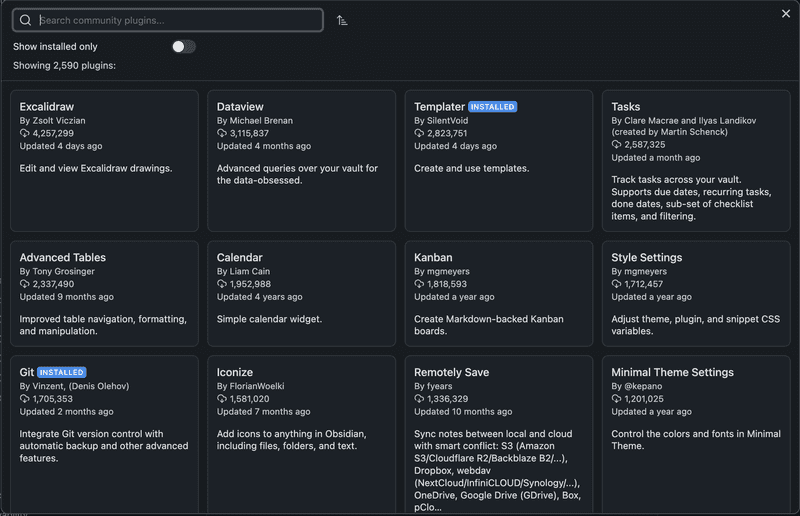
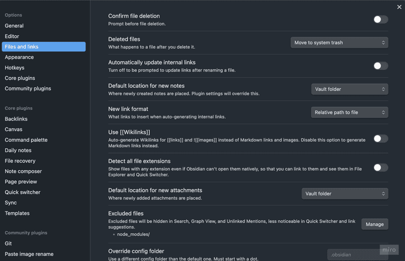
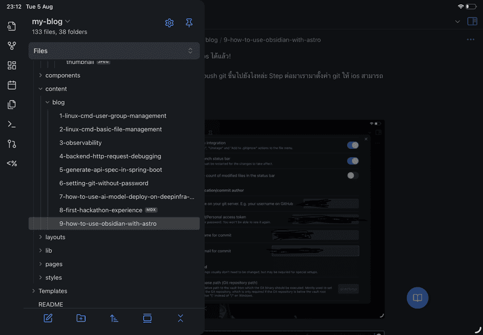
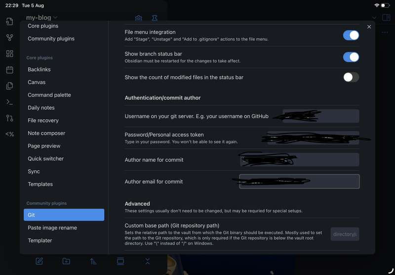

หลายคนที่เริ่มเขียนบล็อกด้วย framework อย่าง Astro คงจะเคยเจอปัญหาเวลาเขียน Markdown อยู่บ้าง โดยเฉพาะตอนที่ต้องการแทรกรูปภาพหรือจัดเนื้อหาให้ดูดี

สำหรับผม ปัญหาหลักๆ ที่เจอบ่อยคือ:
- ไม่มี preview ที่ดีตอนเขียน Markdown
- เวลาแทรกรูปต้องมาจัด path เอง
- การย้าย section หรือจัดโครงสร้างเนื้อหา ทำได้ไม่คล่องเหมือนเวลาเขียนใน note app
- เขียนใน platform อื่นๆ ได้ยากเช่น มือถือ หรือแท็บเล็ต

จนกระทั่งผมได้ลองใช้ **Obsidian** มาช่วยเขียน Markdown แทน — ซึ่งปรากฏว่ามันเวิร์กมาก

ในบล็อกนี้ ผมจะมาแชร์ว่าผมตั้งค่า Obsidian ยังไงใช้ plugin ตัวไหนบ้าง เพื่อให้ Obsidian ทำงานร่วมกับ Astro ได้อย่างราบรื่น และสะดวกที่สุด
## ทำไมต้องใช้ Obsidian?


Obsidian เป็นแอปจดบันทึกที่ออกแบบมาสำหรับคนที่ชอบเขียน และจัดการข้อมูลด้วยไฟล์ Markdown โดยเฉพาะ จุดเด่นของมันคือความ ยืดหยุ่น ปรับแต่งได้อย่างอิสระ

สิ่งที่ทำให้ Obsidian เหมาะมากกับการเขียนบล็อก คือ
- มี editor ที่สามารถเขียน​ Markdown ได้ง่าย
	- Obsidian มีโหมด live preview ที่ช่วยให้เราเห็นผลลัพธ์ Markdown ทันทีขณะพิมพ์ ไม่ต้องสลับหน้าจอไปมาให้เสียเวลา ทำให้รู้สึกเหมือนเขียนใน Notion
- การแทรกรูปสามารถทำได้ง่าย
	- ปกติการแทรกรูปใน Markdown ต้องลากไฟล์ไปไว้ในโฟลเดอร์ asset แล้วพิมพ์ path เอง ซึ่งค่อนข้างวุ่นวาย แต่ใน Obsidian เราสามารถลากรูปมาวางบน editor ตรงๆ ได้เลย มันจะสร้าง path และจัดเก็บรูปไว้ในโฟลเดอร์ที่เรากำหนดแบบอัตโนมัติ — ใช้ง่ายสุดๆ
- มี plugin ที่ช่วยในการเขียนบล็อกเยอะมาก
- ใช้งานได้ทั้งบนคอม และมือถือ

## ลองใช้ Obsidian กับ โปรเจกต์ Astro

เริ่มจากเปิด Obsidian โดยชี้ไปที่ path ของโปรเจกต์ Astro
- คลิก `Open folder as vault` แล้วเลือก path ไปที่ root ของโปรเจกต์ Astro (เช่น `~/Projects/my-blog`)
- Obsidian จะมองเห็นไฟล์ทั้งหมดของ Astro รวมถึงโฟลเดอร์ที่ใช้เก็บ Markdown

ทุกอย่างดูราบรื่นดี — ผมสามารถเปิดไฟล์ .md ขึ้นมาเขียนผ่าน editor ของ Obsidian ได้เลย

แต่พอเริ่มใช้งานจริง กลับเจอปัญหาหลายอย่างดังนี้
- ไฟล์ .mdx ที่ใช้ใน Astro ไม่แสดงใน sidebar
- เมื่อเขียนบล็อกเสร็จแล้วอยาก sync ไฟล์ขึ้น Git ต้องเปิด terminal เพื่อรันคำสั่ง git commit และ push ทุกครั้ง
- อยากแทรกรูปใน Markdown แต่ path ที่ Obsidian สร้างให้อัตโนมัติกลับไม่ตรงกับโครงสร้างของโปรเจกต์ที่เราวางไว้ ส่งผลให้เวลานำไปใช้จริง path เหล่านั้นใช้จะงานไม่ได้ ทำให้สุดท้ายต้องย้ายไฟล์และแก้ path ด้วยตัวเองอยู่ดี

แต่โชคดีที่ Obsidian มีระบบ **Community plugin** ที่จะช่วยแก้ปัญหาเหล่านี้ได้

โดยใน step ถัดไปผมจะแนะนำ plugin และ วิธีการตั้งค่าต่างๆที่ผมใช้

## วิธีติดตั้ง Community Plugin

หากยังไม่เคยเปิดใช้ community plugin ใน Obsidian ให้ทำตามขั้นตอนนี้ก่อน:
1. ไปที่เมนู **Settings → Community plugins**


2. คลิกปุ่ม `Turn on community plugins` เพื่อเปิดการใช้งาน community plugin
3. คลิกปุ่ม `Browse` เพื่อค้นหาและติดตั้ง plugin ที่ต้องการ



## MDX plugin

เป็น plugin ที่ช่วยให้ Obsidian สามารถเปิดและแก้ไขไฟล์ `.mdx` ได้เหมือนกับไฟล์ Markdown ทั่วไป

เมื่อติดตั้งเรียบร้อยแล้ว Obsidian จะแสดงไฟล์ `.mdx` ใน sidebar และสามารถเปิดแก้ไขผ่าน editor ได้ทันที

## Git plugin

เป็น plugin ที่ช่วยให้ Obsidian สามารถเชื่อมต่อกับ Git ได้โดยตรง ทำให้สามารถใช้คำสั่งพื้นฐานอย่าง commit, pull, push ได้จาก Obsidian โดยไม่ต้องสลับไปที่ terminal หรือ Git client ภายนอกให้ยุ่งยาก

## Paste rename plugin

เป็น plugin ที่ช่วยจัดการชื่อไฟล์และ path ของรูปภาพที่เราแทรกใน Obsidian ได้แบบอัตโนมัติ

โดยปกติเมื่อเราแทรกรูปลงใน Obsidian ตัวไฟล์จะถูกบันทึกไว้ในโฟลเดอร์ root ของ vault ซึ่งอาจไม่ตรงกับโครงสร้างที่เราวางไว้ในโปรเจกต์ Astro

plugin นี้จะเข้ามาช่วย **เปลี่ยนชื่อไฟล์ และ **กำหนด path ปลายทางตาม pattern ที่เราต้องการอัตโนมัติ**
เหมาะมากถ้าเราวาง pattern การเก็บรูปภาพใน asset ไว้ชัดเจน เช่นอยากให้รูปทั้งหมดอยู่ในโฟลเดอร์ `public/images/blog/${markdown-file-name}`

ก่อนเริ่มใช้งาน เราควรตั้งค่ารูปแบบการอ้างอิงไฟล์ภาพให้เรียบร้อย โดยไปที่ **Settings → File and links** จากนั้นทำการปรับ `New link format` เป็น `Relative path to files` เพื่อตั้งค่าให้การอ้างอิงรูปของ Obsidian เป็น relative path



จากนั้นให้ตั้งค่า plugin โดยไปที่ **Settings → Paste image rename**


ให้ใส่ค่า **Image name pattern** ที่สอดคล้องกับโครงสร้างของโปรเจกต์

ในตัวอย่างนี้ ผมตั้งค่าให้ asset ของแต่ละบทความถูกแยกโฟลเดอร์ตามชื่อไฟล์ Markdown โดยใช้ pattern แบบนี้:

```
src/assets/blogs/{{fileName}}/{{DATE:YYYYMMDDHHmmssSSS}}
```

ซี่ง plugin นี้รองรับการใช้ **ตัวแปร** เพื่อช่วยกำหนด path ได้อย่างยืดหยุ่น เช่น:
- `{{fileName}}` → แทนชื่อไฟล์ Markdown ที่กำลังเขียนอยู่
- `{{DATE}}` → แสดงวันที่และเวลาปัจจุบัน (สามารถกำหนด format ได้ เช่น `{{DATE:YYYYMMDDHHmmssSSS}})`

> ซึ่งนอกจากตัวแปรที่ผมยกตัวอย่างมา ยังมีตัวแปรอื่นให้ใช้อีก สามารถดูรายละเอียดเพิ่มเติมได้ที่ https://github.com/reorx/obsidian-paste-image-rename

**ตัวอย่าง:**
ถ้าเรากำลังเขียนไฟล์ชื่อ `how-to-test.md` แล้วทำการแทรกภาพ plugin จะเปลี่ยนชื่อ และย้ายรูปภาพไว้ที่ path

```
src/assets/blogs/how-to-test/20250805191653926.png
```

สาเหตุที่ผมเลือกใช้ตัวแปร `{{DATE}}` เป็นชื่อไฟล์ก็เพื่อ **ป้องชื่อไฟล์รูปภาพซ้ำ**

จริงๆ แล้ว plugin นี้มีฟีเจอร์ที่ช่วยหลีกเลี่ยงชื่อไฟล์ซ้ำให้อัตโนมัติอยู่แล้ว โดยการเติม prefix หรือ postfix (ขึ้นอยู่กับการตั้งค่า) เป็นตัวเลข เช่น `image-1.png`, `image-2.png`

แต่มีข้อจำกัดตรงที่ — หากเราใช้ Image name pattern เป็น **path** (เช่นมีโฟลเดอร์ย่อยรวมอยู่ด้วย) แทนที่จะใช้แค่ชื่อไฟล์อย่างเดียว จะไม่สามารถใช้ฟีเจอร์นี้ได้

เพื่อแก้ปัญหานี้ ผมจึงเลือกใช้ `{{DATE:YYYYMMDDHHmmssSSS}}` แทนเป็นชื่อไฟล์
ซึ่งจะทำให้แต่ละรูปมีชื่อไม่ซ้ำกันแน่นอน เพราะฝัง timestamp ลงไปในชื่อเลย

เพียงเท่านี้เมื่อเราทำการแทรกรูปใน editor Obisidian ก็จะอ้างอิง และวางไฟล์ตามโครงสร้างโปรเจกต์ของ Astro แล้ว

## Templater

เป็น plugin ที่ช่วยให้เราสร้าง template ที่ **ยืดหยุ่นและเขียน logic ได้เหมือนเขียน script** ไม่ใช่แค่การแทนที่ข้อความแบบ static เหมือน template ปกติของ Obsidian

ถ้าใครเคยรู้สึกว่าเวลาเริ่มเขียนบทความใหม่แล้วต้องมานั่งพิมพ์ frontmatter เดิมๆ ทุกครั้ง เช่น title, date, tags, draft ฯลฯ plugin ตัวนี้จะช่วยให้ชีวิตง่ายขึ้นมาก

เริ่มต้นด้วยการสร้างโฟลเดอร์ชื่อ `Templates` ที่ root ของ vault เพื่อใช้เก็บไฟล์ template ต่าง ๆ

จากนั้นสร้าง template สำหรับเพิ่มบทความใหม่ เช่น `blog-template.md`

ผมจะขอยกตัวอย่าง template ที่ผมใช้งานจริงในตอนนี้

```
…
```
โดย template นี้จะยกตัวอย่างการ สร้าง frontmatter โดยอ้างอิงจากชื่อบทความจากชื่อไฟล์ วันที่สร้างจากวันเวลาปัจจุบัน และแสดง dialog เพื่อถามว่าตั่งชื่อไฟล์อะไรเมื่อ ผู้ใช้งานกรอกชื่อไฟล์แล้ว template นี้จะทำการไปสร้างโฟลเดอร์ asset ให้เพื่อให้สามารถวางรูปของ บทความนีัได้

> plugin ตัวนี้สามารถประยุกต์ และปรับแต่งได้หลาย มาก สามารถดูรายละเอียดได้ที่  https://silentvoid13.github.io/Templater/introduction.html

ต้้งค่า plugin ให้ใช้ template ในการสร้างบทความ โดยไปที่ **Settings → Templater** 

ลองทดสอบสร้างไฟล์ใหม่ดู
## ใช้ Obsidian บน iOS

เพื่อให้ iOS สามารถใช้ Obsidian ได้ให้เราทำการดาวน์โหลดแอป Obsidian ลงบนเครื่องก่อน

เมื่อเข้า Obsidian ในครั้งแรกจะให้เราสร้าง vault ให้คลิกปุ่ม `Create a vault`


จากนั้นให้พิมพ์ชื่อ vault ที่ต้องการ และคลิกปุ่ม `Create a vault`


Step ต่อมาเราจะมา clone repo Astro ของเราลงเครื่องกัน

โดยใน iOS นั้นไม่สามารถใช้ git ได้โดยตรงเราจึงต้องใช้แอป `iSH` ซึ่งเป็นแอปจำลอง linux alpine ให้สามารถรันบน iOS ได้

ซึ่งเมื่อเราใช้ linux บน iOS ได้แปลว่าเราสามารถใช้ git ได้เหมือนในคอมเลย

เมื่อดาวน์โหลดแอป `iSH` เสร็จแล้วให้เข้าแอปจะเจอหน้า terminal


ทำการติดตั้ง Git โดยใช้คำสั่ง

```bash
apk add git
```

จากนั้นทำการสร้างโฟลเดอร์สำหรับเก็บโปรเจกต์ Astro ของเราโดยในที่นี้ผมจะตั้งชื่อให้ล้อไปกับ vault ที่เราสร้างเมื่อสักครู่

```bash
mkdir obsidian-my-blog
```

เนื่องจาก iOS จำกัดการเข้าถึงไฟล์ระหว่างแอปผ่าน sandboxing ทำให้ไม่สามารถให้แอป iSH เข้าถึงไฟล์ของแอป Obsidian ได้โดยตรง

เราจึงใช้วิธี mount โฟลเดอร์จากภายในระบบ Linux ของ iSH ให้เชื่อมกับ vault ของ Obsidian แทน 

ซึ่งวิธีนี้จะช่วยให้สามารถแก้ไขไฟล์ได้ผ่าน shell command โดยไม่ต้องย้ายไฟล์ข้ามแอป

```bash
mount -t ios . obsidian-my-blog
```

เมื่อรันคำสั่ง mount iOS จะให้เราเลือกโฟลเดอร์ปลายทางให้เราไปที่  **On My iPad → Obsidian** จากนั้นเลือกโฟลเดอร์ที่ชื่อเดียวกับ vault ที่เราตั้งเมื่อสักครู่


เพียงเท่านี้เราก็สามารถเข้าถึงโฟลเดอร์ vault ได้ผ่านแอป`iSH` แล้ว

Step ต่อไปเราจะทำการ clone โปรเจกต์เข้าโฟลเดอร์ vault กัน

ก่อนอื่นเราจะต้องลบโฟลเดอร์ `.obsidian` ที่อยู่ในโฟลเดอร์ vault เสียก่อนเพื่อไม่ให้ไฟล์มันซ้ำตอนที่เราจะ clone โปรเจกต์ โดยการรันคำสั่ง

```bash
cd obsidian-my-blog
rm -rf .obisdian
```

ทำการ clone โปรเจกต์ลงในโฟลเดอร์ปัจจุบันด้วยคำสั่ง

```bash
git clone https://github.com/{your-username}/{your-repo}.git ./
```

> ในส่วน password แนะนำให้ใช้ PAT (Personal access token) ซึ่งถ้าผู้อ่านใช้ github สามารถดูตัวอย่างการขอ PAT ได้ที่ https://docs.github.com/en/authentication/keeping-your-account-and-data-secure/managing-your-personal-access-tokens

เมื่อ clone โปรเจกต์สำเร็จให้เปิดแอป`Obsidian` จะพบ dialog ถามเราว่าจะ trust vault นี้ไหมเนื่องด้วยโปรเจกต์ที่ clone มามีการเปิด community plugin ไว้ ให้เราคลิกปุ่ม `Trust author and enable plugins`


จากนั้น `Obsidian` จะทำการโหลดการตั้งค่า และ community plugin ทั้งหมดที่เราตั้งค่าไว้

แต่เดี๋ยวก่อน... แล้วเราจะ commit และ push git ขึ้นไปยังไงหล่ะ 

Step ต่อมาเรามาตั้งค่า git ให้ iOS สามารถใช้งานได้ผ่านแอป`Obsidian` กัน

ไปที่การตั้งค่าด้วยการ คลิกปุ่มเปิด side menu ด้านซ้ายบน จากนั้นคลิกปุ่มรูปเฟืองเพื่อเข้าเมนูการตั้งค่า



ไปที่หัวข้อ `Git` ตั้งค่าในส่วน `Authentication/commit author` ให้เรียบร้อย



เพื่อทดสอบการ commit ให้ทำการแก้ไขไฟล์ในโปรเจกต์ จากนั้นคลิกปุ่มเปิด sidebar ด้านขวาบนเพื่อเปิด plugin Git และทำการทดสอบ commit และ push


เพียงเท่านี้เราก็สามารถอัพเดทบล็อกของเราบน iOS ได้แล้ว

> ส่วนฝั่ง Android เนื่องจากเจ้าของ blog ไม่มี device android เลยไม่ขอลง detail แต่คิดว่าสามารถใช้วิธีเดียวกับทางฝั่ง iOS ได้เลย 

หวังว่าบทความนี้จะช่วยให้การเขียนบล็อกของคุณสนุกขึ้นไม่มากก็น้อย

ไว้เจอกันใหม่ในบทความหน้า สวัสดีครับ