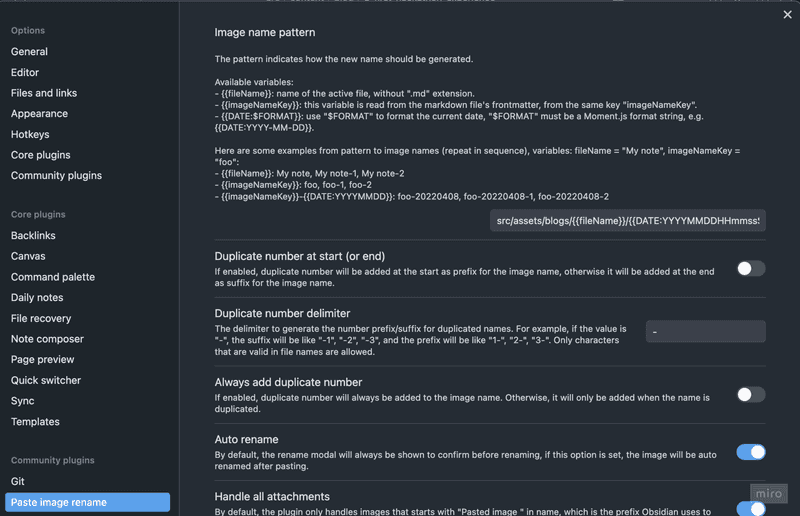

หลายคนที่เริ่มเขียนบล็อกด้วย framework อย่าง Astro คงจะเคยเจอปัญหาเวลาเขียน Markdown อยู่บ้าง โดยเฉพาะตอนที่ต้องการแทรกรูปภาพหรือจัดเนื้อหาให้ดูดี

สำหรับผม ปัญหาหลักๆ ที่เจอบ่อยคือ:
- ไม่มี preview ที่ดีตอนเขียน Markdown
- เวลาแทรกรูปต้องมาจัด path เอง
- การย้าย section หรือจัดโครงสร้างเนื้อหา ทำได้ไม่คล่องเหมือนเวลาเขียนใน note app
- เขียนใน platform อื่นๆ ได้ยากเช่น มือถือ หรือ แท็บเล็ต

จนกระทั่งผมได้ลองใช้ **Obsidian** มาช่วยเขียน Markdown แทน — ซึ่งปรากฏว่ามันเวิร์กมาก

ในบล็อกนี้ ผมจะมาแชร์ว่าใช้ plugin ตัวไหนบ้าง พร้อมวิธีตั้งค่าให้ Obsidian ทำงานร่วมกับ Astro ได้อย่างราบรื่นและสะดวกที่สุด
## ทำไมต้องใช้ Obsidian?


Obsidian เป็นแอปจดบันทึกที่ออกแบบมาสำหรับคนที่ชอบเขียนและจัดการข้อมูลด้วยไฟล์ Markdown โดยเฉพาะ จุดเด่นของมันคือความ “เบา ยืดหยุ่น และควบคุมได้ทุกอย่าง” ซึ่งตรงกับความต้องการของสายเขียนบล็อก ที่ต้องการทั้งความเป็นระเบียบและอิสระในการจัดการเนื้อหา

สิ่งที่ทำให้ Obsidian เหมาะมากกับการเขียนบล็อก คือ
- มี editor ที่สามารถเขียน​ Markdown ได้ง่าย
	- Obsidian มีโหมด live preview ที่ช่วยให้เราเห็นผลลัพธ์ Markdown ทันทีขณะพิมพ์ ไม่ต้องสลับหน้าจอไปมาให้เสียเวลา ทำให้รู้สึกเหมือนเขียนใน Notion
- การแทรกรูปสามารถทำได้ง่าย
	- ปกติการแทรกรูปใน Markdown ต้องลากไฟล์ไปไว้ในโฟลเดอร์ asset แล้วพิมพ์ path เอง ซึ่งค่อนข้างวุ่นวาย แต่ใน Obsidian สามารถลากรูปมาวางบน editor ตรงๆ ได้เลย มันจะสร้าง path และจัดเก็บรูปไว้ในโฟลเดอร์ที่เรากำหนดแบบอัตโนมัติ — ใช้ง่ายสุดๆ
- มี plugin ที่ช่วยในการเขียน blog เยอะมาก
- ใช้งานได้ทั้งบน Desktop และ Mobile

## ลองใช้ Obsidian กับ โปรเจกต์ Astro

ผมเริ่มจากเปิด Obsidian โดยชี้ไปที่ path ของโปรเจกต์ Astro
- คลิก `Open folder as vault` แล้วเลือก path ไปที่ root ของโปรเจกต์ Astro (เช่น `~/Projects/my-blog`)
- Obsidian จะมองเห็นไฟล์ทั้งหมดของ Astro รวมถึงโฟลเดอร์ที่ใช้เก็บ Markdown

ทุกอย่างดูราบรื่นดี — ผมสามารถเปิดไฟล์ .md ขึ้นมาเขียนผ่าน editor ของ Obsidian ได้เลย

แต่พอเริ่มใช้งานจริง กลับเจอปัญหาหลายอย่างดังนี้
- ไฟล์ .mdx ที่ใช้ใน Astro กลับไม่แสดงใน sidebar
- เวลาเขียนเสร็จแล้วอยาก sync ไฟล์ขึ้น Git ต้องเปิด terminal เพื่อรันคำสั่ง git commit และ push ทุกครั้ง
- อยากแทรกรูปใน Markdown แต่ path ที่ Obsidian สร้างให้อัตโนมัติกลับไม่ตรงกับโครงสร้างของโปรเจกต์ที่เราวางไว้ ส่งผลให้เวลานำไปใช้จริง path เหล่านั้นใช้งานไม่ได้ ทำให้สุดท้ายต้องย้ายไฟล์และแก้ path ด้วยตัวเองอยู่ดี

แต่โชคดีที่ Obsidian มีระบบ **Community plugin** ที่จะช่วยแก้ปัญหาเหล่านี้ได้

โดยใน step ถัดไปผมจะแนะนำ plugin และ วิธีการตั้งค่าต่างๆที่ผมใช้

## วิธีติดตั้ง Community Plugin

หากยังไม่เคยเปิดใช้ community plugin ใน Obsidian ให้ทำตามขั้นตอนนี้ก่อน:
1. ไปที่เมนู **Settings → Community plugins**


2. คลิก **“Turn on community plugins”** เพื่อเปิดการใช้งาน community plugin
3. กด **“Browse”** เพื่อค้นหาและติดตั้ง plugin ที่ต้องการ


## MDX plugin

เป็น plugin ที่ช่วยให้ Obsidian สามารถเปิดและแก้ไขไฟล์ `.mdx` ได้เหมือนกับไฟล์ Markdown ทั่วไป

เมื่อติดตั้งเรียบร้อยแล้ว Obsidian จะแสดงไฟล์ `.mdx` ใน sidebar และสามารถเปิดแก้ไขได้ผ่าน editor ได้ทันที

## Git plugin

เป็น plugin ที่ช่วยให้ Obsidian สามารถเชื่อมต่อกับ Git ได้โดยตรง ทำให้สามารถใช้คำสั่งพื้นฐานอย่าง commit, pull, push ได้เลยจากใน Obsidian โดยไม่ต้องสลับไปที่ terminal หรือ Git client ภายนอกให้ยุ่งยาก

## Paste rename plugin

เป็น plugin ที่ช่วยจัดการชื่อไฟล์และ path ของรูปภาพที่เราแทรกใน Obsidian ได้แบบอัตโนมัติ

โดยปกติเมื่อเราแทรกรูปลงใน Obsidian ตัวไฟล์จะถูกบันทึกไว้ใน root directory ของ vault ซึ่งอาจไม่ตรงกับโครงสร้างที่เราออกแบบไว้ในโปรเจกต์ Astro
Plugin นี้จะเข้ามาช่วย **เปลี่ยนชื่อไฟล์อัตโนมัติ** และ **กำหนด path ปลายทางตาม pattern ที่เราต้องการ**
เหมาะมากถ้าเราวาง pattern การเก็บรูปภาพใน asset ไว้ชัดเจน เช่นอยากให้รูปทั้งหมดอยู่ใน `public/images/blog/${markdown-file-name}`

ในการใช้งานเราจำเป็นจะต้องตั้งค่าการอ้างอิงไฟล์รูปภาพเสียก่อน โดยไปที่ **Settings → File and links** จากนั้นทำการปรับ `New link format` เป็น `Relative path to files` เพื่อปรับให้การอ้างอิงรูปของ Obsidian เป็น relative path


จากนั้นให้ตั้งค่า plugin โดยไปที่ **Settings → Paste image rename**



ให้ใส่ค่า **Image name pattern** ที่สอดคล้องกับโครงสร้างของโปรเจกต์

ในตัวอย่างนี้ ผมตั้งค่าให้ asset ของแต่ละบทความถูกแยกโฟลเดอร์ตามชื่อไฟล์ Markdown โดยใช้ pattern แบบนี้:
```
src/assets/blogs/{{fileName}}/{{DATE:YYYYMMDDHHmmssSSS}}
```

ซี่ง plugin นี้รองรับการใช้ **ตัวแปร** เพื่อช่วยกำหนด path ได้อย่างยืดหยุ่น เช่น:
- `{{fileName}}` → แทนชื่อไฟล์ Markdown ที่กำลังเขียนอยู่
- `{{DATE}}` → แสดงวันที่และเวลาปัจจุบัน (สามารถกำหนด format ได้ เช่น `{{DATE:YYYYMMDDHHmmssSSS}})`

> สามารถดูรายละเอียดเพิ่มเติมได้ที่ ...

**ตัวอย่าง:**
ถ้าเรากำลังเขียนไฟล์ชื่อ `how-to-test.md` แล้วทำการแทรกภาพระบบจะบันทึกรูปภาพไว้ที่ path:

```
src/assets/blogs/how-to-test/20250805191653926.png
```

สาเหตุที่ผมเลือกใช้ตัวแปร `{{DATE}}` เป็นชื่อไฟล์ก็เพื่อ **ป้องกันการซ้ำของชื่อไฟล์รูปภาพ**

จริงๆ แล้ว plugin นี้มีฟีเจอร์ที่ช่วยหลีกเลี่ยงชื่อไฟล์ซ้ำให้อัตโนมัติอยู่แล้ว โดยการเติม prefix หรือ postfix (ขึ้นอยู่กับการตั้งค่า) เป็นตัวเลข เช่น `image-1.png`, `image-2.png`

แต่มีข้อจำกัดตรงที่ — หากเราใช้ Image name pattern เป็น **path** (เช่นมีโฟลเดอร์ย่อยรวมอยู่ด้วย) แทนที่จะใช้แค่ชื่อไฟล์อย่างเดียว จะไม่สามารถใช้ฟีเจอร์นี้ได้

เพื่อแก้ปัญหานี้ ผมจึงเลือกใช้ `{{DATE:YYYYMMDDHHmmssSSS}}` แทนเป็นชื่อไฟล์
ซึ่งจะทำให้แต่ละรูปมีชื่อไม่ซ้ำกันแน่นอน เพราะฝัง timestamp ลงไปในชื่อเลย


เพียงเท่านี้เมื่อเราทำการแทรกรูป Obisidian ก็จะอ้างอิง และวางไฟล์ตามโครงสร้างโปรเจกต์ของ Astro แล้ว

## Templater

เป็น plugin ที่ช่วยให้เราสามารถกำหนด template สำหรับไฟล์ใหม่ได้อย่างยืดหยุ่นและทรงพลังมากกว่าการใช้ template ปกติที่มากับ Obsidian

ถ้าใครเคยรู้สึกว่าเวลาเริ่มเขียนบทความใหม่แล้วต้องมานั่งพิมพ์ frontmatter เดิมๆ ทุกครั้ง เช่น title, date, tags, draft ฯลฯ plugin ตัวนี้จะช่วยให้ชีวิตง่ายขึ้นมาก
## ใช้ Obisidain บน IOS


